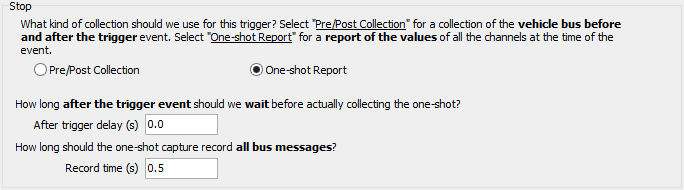

# Message Capture Method: Stop Options: One Shot Report

When using the Message Capture method for Standalone Logging within VehicleScape DAQ, selecting **Using Trigger Expression** for the Collection Start Option causes the Collection Configuration to consist of two options: Pre/Post Collection and One-shot Report (described here). The One-shot Report is also used for the Bus Query method.

Figure 1 shows the appearance of the Stop Options subsection of the Standalone Logging tab when **One-shot Report** is selected.

### After trigger delay

This entry specifies how long the logger should wait after the trigger event to log the data snapshot. If set to 0, the one-shot report occurs immediately.

### Record time

How much time the logger should spend capturing bus messages.
