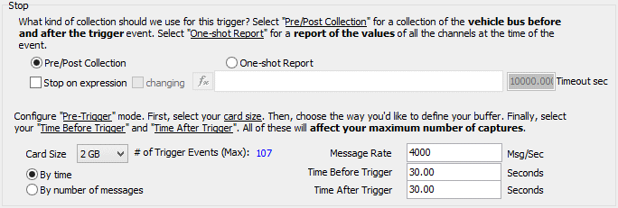

# Message Capture Method: Stop Options: Pre/Post Collection

When using the Message Capture method for Standalone Logging within VehicleScape DAQ, selecting **Start using trigger expression** for the Start Option provides two Stop Options: **Pre/Post Collection** (described here) and One-shot Report.

Figure 1 shows the default appearance of the **Stop** subsection of the Standalone Logging tab when **Pre/Post Collection** is selected. The settings and prompts will change slightly depending on the parameters selected.

### Stop on expression

The **Stop on expression** box controls the overall behavior of this stop option. Check the box to have logging stop when the expression is true, then use the  button to select the expression using the Expression Editor.

Checking the box enables these optional features:

* **changing:** If checked, logging stops when the specified expression changes.
* **Timeout sec:** If logging doesn't stop due to the expression becoming true (or changing, if the **changing** box is checked) then it will time out and stop automatically after the specified number of seconds. Set this value to 0 to disable the timeout feature (so logging will only stop based on the expression logic).

**Note:** Checking the **Stop on expression** box changes some **Pre-Trigger and Post-Trigger** settings (see below) and removes the **Stop** option from Restart Options.

### Pre-Trigger and Post-Trigger Settings

The options in this area control how much data is collected before and after the defined trigger expression. There are two main choices:

* **By time:** Logging occurs for a certain number of seconds in a window around the trigger, based on the values in the **Time Before Trigger** and **Time After Trigger** boxes.
* **By number of messages:** Logging of a specific number of messages occurs in a window around the trigger, controlled by the **Messages Before Trigger** and **Messages After Trigger** boxes.

### Card Size and # of Trigger Events

A drop-down box called **Card Size** also appears in this area. Select the size of the SD card being used in the standalone logger, and Vehicle Spy will estimate the maximum number of trigger events that it can hold based on your chosen parameters.

This option is not relevant when the **Stop on expression** feature is used, so it doesn't appear if that box is checked.
