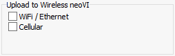

# Message Capture Method: Upload to Wireless neoVI

In [VehicleScape DAQ](../../) [Standalone Logging](../), the **Upload to Wireless neoVI** settings for the [Message Capture](collections-and-methods-message-capture-method/) method enable the wireless communication capabilities of the neoVI PLASMA. There are two options (Figure 1):

* **WiFi / Ethernet:** Each time this collection stops, automatically upload its log file to a WirelessNeoVI server using the neoVI PLASMA WiFi or Ethernet link.
* **Cellular:** Each time this collection stops, automatically upload its log file to a WirelessNeoVI server using the neoVI PLASMA 3G cellular link.

WiFi is faster than 3G, but WiFi signals may be hard to find in some areas. Cellular is slower, but has more universal signal coverage.

**Note:** These settings may also be used by the [Bus Query](collections-and-methods-bus-query-method.md) method when the appropriate hardware is in place.

