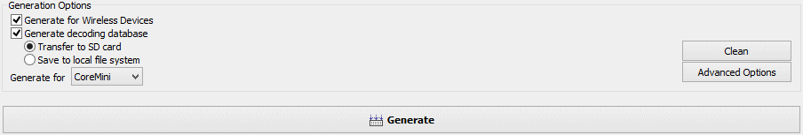

# Standalone Logging: Generation Options

The last of the Standalone Logging sections contains options that control the generation of the logger script, and the **Generate** button, which actually initiates the generation. These are universal settings that apply to all collections using any of the four collection methods: Message Capture, Histogram, Bus Query or Ethernet DAQ.

Figure 1 shows the primary settings for the Generation Options section of Standalone Logging. The options are explained in detail below.

### Generate for Wireless Devices

Selecting this option will cause Vehicle Spy to add Wireless neoVI features to the generated script. This should only be checked when using supported devices.

### Generate Decoding Database

You can have Vehicle Spy generate a database for you that will decode the data logged by your setup using the databases you have chosen.

When this feature is enabled, you have a choice of where to put the data:

* **Transfer to SD card:** Save the decoding database to the logger's SD card.
* **Save to local file system:** Save the decoding database on the PC.

### Generate For CoreMini / Vehicle Spy

Normally this drop-down box will be set to **CoreMini** to generate a CoreMini script to download to a logger. Change it to **Vehicle Spy** to generate a script for use within the software, such as for debugging purposes.

### Clean Button

Press this button to remove automatically-generated function blocks, application signals and messages with the "\_VSSAL" suffix. This essentially undoes the actions of the **Generate** button.

### Advanced Options

Press the **Advanced Options** button to launch the **Advanced Generator Options** dialog box. This interface has three tabs, which are explained below.

Several general options can be set here (Figure 2):

* **Force use of partitions:** When checked, partitions are always used, not only for pre/post collections.
* **Override number of partitions calculation:** Overrides the calculated number of partitions with a specific value.
* **Use EnterExtendedSeession:** When using ISO 14229, use diagnostic job $10/03 to initiate diagnostics with ECUs.
* **MISC I/O for power management batt. pack or data acq. device:** When enabled, allows you to select a MISC I/O output on the ICS logger to control external devices across logger sleep/wake cycles.
* **Networks to ignore for the "On No Bus Activity" option:** Select which networks, if any, are to be ignored in the expression that is generated to put the logger to sleep.

**Note:** The **Networks to ignore for the "On No Bus Activity" option** settings are the same as those found under **Advanced Options** in the Power Management area.

### Auto Disable Diagnostics Tab

The options in this tab (Figure 3) allow you to configure diagnostics to be automatically disabled under certain conditions.

The primary option is **Automatically stop diagnostic requests to ECUs when a separate tool makes a request**. This is disabled by default; when enabled, diagnostic requests will be stopped when another tool makes a request. Selecting this option also enables the other settings in this area (Figure 3).

If you have enabled the option above, the **If no diag commands exist from a separate tool restart commands after timeout** option is available. When selected, if an amount of time elapses greater than the figure next to **Timeout in seconds** without diagnostic requests from a separate tool being received, then normal diagnostic commands will resume.

The table at the bottom of the tab allows you to add or delete specific IDs and networks. If a message appears matching any network / arbitration ID pair, the logger will stop transmitting all diagnostic messages.

### Sleep User Function Blocks Tab

In this tab (Figure 4) you can select function blocks to stop running when the logger enters sleep mode, and those that should begin running when the device wakes up.

**Note:** These settings are the same as those found under **Advanced Options** in the Power Management area.

### Generate Button

This is the main **Go!** button for the Standalone Logging feature. When pressed, Vehicle Spy will use all of the settings entered into various areas of Standalone Logging, and generate the appropriate function blocks, application signals and messages. All generated content will be marked with the suffix "\_VSSAL" (for "**V**ehicle**S**cape DAQ **S**tand**A**lone **L**ogging").

Pressing the **Generate** button also opens the CoreMini console, which compiles and saves the generated information.
