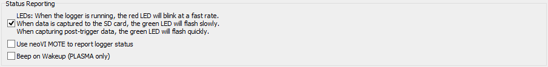

# Standalone Logging: Status Reporting

In the Standalone Logging mode of VehicleScape DAQ, the Status Reporting section contains options that specify how feedback is provided on the state of the logging process. These are universal settings that apply to all collections using any of the four collection methods: Message Capture, Histogram, Bus Query or Ethernet DAQ.

The default appearance of this subsection of the Standalone Logging screen can be found in Figure 1.

There are three main options here, each of which is enabled with a checkbox: **LEDs**, **Use neoVI MOTE** and **Beep on Wakeup (PLASMA only)**.

### LEDs

Use LEDs to indicate the current logger status:

* **Red LED Flashing:** Logger is running.
* **Green LED Flashing Slowly:** Data is being captured to the SD card.
* **Green LED Flashing Quickly:** Post-trigger data is being captured.

### Use neoVI MOTE

Use the neoVI MOTE for simple feedback and control features. Enabling this option causes additional options to appear in the right half of the Status Reporting box (Figure 2).

Special options for using the neoVI MOTE for reporting:

* **Network:** Which network to use.
* **Expressions to Display:** Select one or more expressions to be displayed in scrolling text on the neoVI MOTE.
* **Buzz on Start/Trigger:** The neoVI MOTE will make a sound (selectable using the adjacent drop-down box) when the logger is started or triggered.
* **Show "Triggered" Message:** The neoVI MOTE will display a message when the logger has triggered.

### Beep on Wakeup (PLASMA Only)

When enabled, the neoVI PLASMA will beep each time it wakes up.
