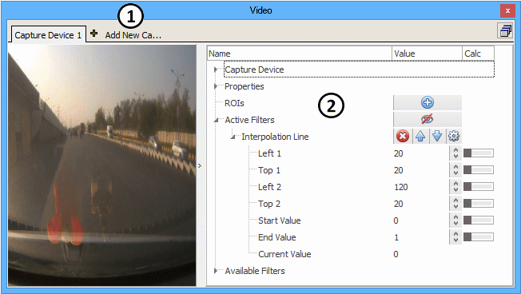
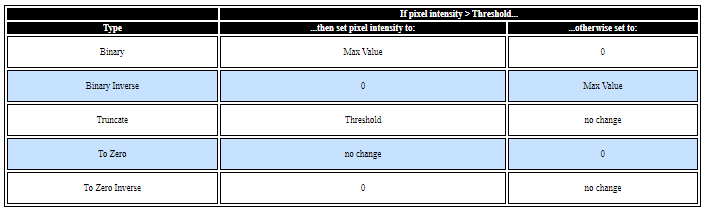

# Video

Vehicle Spy's **Video** view can show and record live video from cameras connected to the PC. Various filters are provided to alter and analyze the video for the purposes of object detection and automated testing. Video view is opened from the [Measurement menu](./). Captured video must be reviewed using the [Video Tab](video.md).

### Overview

Follow these general steps to use the Video view in Vehicle Spy:

1. Choose and setup a camera for the PC.
2. Take Vehicle Spy online with licensed ICS hardware.
3. Add input filters to alter the video and reduce noise.
4. Add output filters to make calculations based upon the altered video.
5. Use [Graphical Panels](graphical-panels/graphical-panels-tools/)/Video and [Expression Builder](../../shared-features-in-vehicle-spy/shared-features-expression-builder.md)/Cameras to process the video calculations.

### Choosing a Camera Type

There are two supported camera types: Capture Device and Axis Network Camera. Capture Devices are local video devices such as USB webcams or built-in laptop cameras. Axis Network Cameras refer to a line of ethernet network cameras manufactured by Axis® Communications which transmit Motion JPEG video over TCP.

Click **Add New Camera** (Figure 1:) to add a camera and select the appropriate type.

### Capture Device Setup

To begin using a capture device, click on **Device Name** in the upper right corner and select the camera from the list. If the camera does not appear on the list, verify it is connected to the PC and that Windows recognizes it. **Width** and **Height** should be set to the camera's video resolution, in pixels. After a camera is selected, start the live video by taking Vehicle Spy [online](../../basic-operation-of-vehicle-spy/running-and-stopping.md) with ICS hardware. Any brand-specific camera settings, if available, can be changed by clicking the cog wheel button labeled **Settings** after taking Vehicle Spy online.

### Axis Network Camera Setup

**Note**: Ethernet must be enabled in Vehicle Spy to communicate with Axis network cameras. To do this, go to the [Tools](../main-menu-tools/) -> [Options](../main-menu-tools/tools-options/), [Spy Networks tab](../main-menu-tools/tools-options/options-spy-networks-tab/) and check the box in the bottom left corner named "Use PC Ethernet interface.". Vehicle Spy must be restarted after changing the ethernet setting. If multiple Ethernet interfaces exist, use the [Logon](../../basic-operation-of-vehicle-spy/the-logon-screen.md) screen to select the interface connected to the camera.

To begin using the Axis network camera, enter its **IP Address** in the upper right corner. The default IP address for Axis cameras is 192.168.0.90. Note that the PC must be on the same subnet as the Axis network camera. Various settings can be changed like FPS (Frames Per Second), Compression, and Camera Number (if more than one). The Request URI text string should be set to /mjpg/video.mjpg. After the Axis camera is set up, start the live video by taking Vehicle Spy [online](../../basic-operation-of-vehicle-spy/running-and-stopping.md) with ICS hardware.

### General Layout and Use of the Video View

A tab for each camera is shown across the top. Live video from the chosen camera is shown on the left. A tree view along the right (Figure 1:) has settings for the chosen camera and also shows the outputs of Calculation filters. **Expand** and **collapse** tree branches by clicking on the little triangles. **Add** items to the tree by clicking on their blue plus button. **Delete** items by clicking on their red X button. **Move** items up and down in the tree by clicking on their blue up and down arrows. Items can be added and edited at any time, but can be deleted and moved only if Vehicle Spy is offline.

Some inputs have a horizontal **on/off switch** on their right side to change between manual and [calculated signal](../../shared-features-in-vehicle-spy/shared-features-calculated-signal-editor/) modes. Some outputs have a **cog wheel** to open a dialog to change the format and units displayed across Vehicle Spy.

### Properties

The **Description** of the video stream changes the labels on the Video view tabs, Expression Builder/Camera sources, and Graphical Panels/Video tools.

Video filters will work while Vehicle Spy is running in simulation mode only if **Filters Enabled in Simulation Mode** is ON.

If **Logging** is enabled then each captured frame will be saved on the PC as a JPG image in a date stamped folder named "Video Capture" in the [Data directory](../main-menu-file/data-directory.md). This feature works only if Vehicle Spy is online with licensed ICS hardware.

### ROIs (Regions of Interest)

Regions of Interest can be used to apply filters only to a specific part of the image. Create an ROI by clicking the blue plus button next to the menu item labeled "ROIs". Change its dimensions using the Top, Left, Bottom, and Right fields, or by clicking and dragging on its corners in the video portion of the view. Filters added to the ROI will only affect the portion of the image covered by the ROI.

### Active and Available Filters

Filters are used to modify the video in real-time. **Active Filters** show which ones are currently being applied to the video. **Available Filters** lists all filters to pick from. To apply a filter, find it in the Available Filters branch then click on its blue plus button. The filter will get added to the Active Filter branch and applied immediately to the video.

Multiple filters can be added to change the entire video image and numerous ROI areas. As a result, be extra careful to verify the filters are on their correct branches because all of them are named Active Filters and Available Filters!

Active filters located higher up in the tree are applied BEFORE active filters located below them

Vehicle Spy uses the Open Source Computer Vision Library (OpenCV) for its video filter algorithms.

### Recording Video Using Video View

The Video tab requires the correct VSB file and a folder named Video\Cam\_<1-8>\JPEG at the same location. Use the following steps to record video using Video view:

1. Verify ICS h/w and a camera are connected to the PC.
2. Verify ICS h/w is also connected to a physical network.
3. Verify ICS h/w has transmit or receive messages at a rate <= 10 ms.
4. On Video view, add a capture camera with **Logging** = ON.
5. Take VSpy online, capture some video for awhile, then go offline. See the Data directory has a new folder named Video Capture + date stamp\Cam\_1\JPEG.
6. Rename the "Video Capture " folder to just "Video".
7. On Messages view, manually [save the buffer](../main-menu-spy-networks/messages-view/messages-view-top-toolbar/save-the-buffer.md) as a VSB file.

### Descriptions of All Video Settings

Table 1: Vehicle Spy Video Settings

| Video Setting                                                                               | Description                                                                                                                                                                                                                                                                                                                                                                                                                                                                                                                                                                                                                                                                                                                                                                                                                                                                                                                                                                                                                                                                                                                                                                       |
| ------------------------------------------------------------------------------------------- | --------------------------------------------------------------------------------------------------------------------------------------------------------------------------------------------------------------------------------------------------------------------------------------------------------------------------------------------------------------------------------------------------------------------------------------------------------------------------------------------------------------------------------------------------------------------------------------------------------------------------------------------------------------------------------------------------------------------------------------------------------------------------------------------------------------------------------------------------------------------------------------------------------------------------------------------------------------------------------------------------------------------------------------------------------------------------------------------------------------------------------------------------------------------------------- |
| **Capture Device**                                                                          | Camera connected to the PC's USB port or a built-in laptop camera.                                                                                                                                                                                                                                                                                                                                                                                                                                                                                                                                                                                                                                                                                                                                                                                                                                                                                                                                                                                                                                                                                                                |
| Device Name                                                                                 | Camera name determined by the setup in the PC operating system.                                                                                                                                                                                                                                                                                                                                                                                                                                                                                                                                                                                                                                                                                                                                                                                                                                                                                                                                                                                                                                                                                                                   |
| Width & Height                                                                              | Video resolution of the capture camera.                                                                                                                                                                                                                                                                                                                                                                                                                                                                                                                                                                                                                                                                                                                                                                                                                                                                                                                                                                                                                                                                                                                                           |
| Settings                                                                                    | Custom settings that depend upon which brand of capture camera is being used.                                                                                                                                                                                                                                                                                                                                                                                                                                                                                                                                                                                                                                                                                                                                                                                                                                                                                                                                                                                                                                                                                                     |
| **Axis® Network Camera**                                                                    | Axis camera connected to the PC's ethernet network.                                                                                                                                                                                                                                                                                                                                                                                                                                                                                                                                                                                                                                                                                                                                                                                                                                                                                                                                                                                                                                                                                                                               |
| IP Address                                                                                  | IP address of the network camera. The default for Axis cameras is 192.168.0.90.                                                                                                                                                                                                                                                                                                                                                                                                                                                                                                                                                                                                                                                                                                                                                                                                                                                                                                                                                                                                                                                                                                   |
| Resolution                                                                                  | Video resolution of the network camera.                                                                                                                                                                                                                                                                                                                                                                                                                                                                                                                                                                                                                                                                                                                                                                                                                                                                                                                                                                                                                                                                                                                                           |
| FPS                                                                                         | Maximum Frames Per Second allowed for the network camera.                                                                                                                                                                                                                                                                                                                                                                                                                                                                                                                                                                                                                                                                                                                                                                                                                                                                                                                                                                                                                                                                                                                         |
| Compression                                                                                 | Compression level of the network camera. A low value gives higher image quality, but also uses more bandwidth and makes larger file sizes.                                                                                                                                                                                                                                                                                                                                                                                                                                                                                                                                                                                                                                                                                                                                                                                                                                                                                                                                                                                                                                        |
| Camera Number                                                                               | A number to identify the camera within a group of cameras.                                                                                                                                                                                                                                                                                                                                                                                                                                                                                                                                                                                                                                                                                                                                                                                                                                                                                                                                                                                                                                                                                                                        |
| Request URI                                                                                 | 
Determines the image format by using a request Uniform Resource Identifier (URI) string as defined per Axis API specifications.  The default string in Vehicle Spy is: /mjpg/video.mjpg
                                                                                                                                                                                                                                                                                                                                                                                                                                                                                                                                                                                                                                                                                                                                                                                                                                                                                                                                                                              |
| **Properties**                                                                              | Various settings for the Video view.                                                                                                                                                                                                                                                                                                                                                                                                                                                                                                                                                                                                                                                                                                                                                                                                                                                                                                                                                                                                                                                                                                                                              |
| Description                                                                                 | Description of the video stream used across Vehicle Spy. (Video tab labels, Expression Builder/Cameras, Graphical Panels/Video)                                                                                                                                                                                                                                                                                                                                                                                                                                                                                                                                                                                                                                                                                                                                                                                                                                                                                                                                                                                                                                                   |
| Filters Enabled in Simulation Mode                                                          | Allows video filters to work while Vehicle Spy is running in [simulation mode](../../basic-operation-of-vehicle-spy/running-and-stopping.md).                                                                                                                                                                                                                                                                                                                                                                                                                                                                                                                                                                                                                                                                                                                                                                                                                                                                                                                                                                                                                                     |
| 
<del>Use Logged Frames in Simulation Mode</del> (use Video Frames Review instead)
 | 
<del>Use video input from replayed frames instead of the attached camera.</del>  Use Video Frames Review instead.
                                                                                                                                                                                                                                                                                                                                                                                                                                                                                                                                                                                                                                                                                                                                                                                                                                                                                                                                                                                                                                                    |
| Logging                                                                                     | If enabled, each captured frame will be saved as a JPG image in a folder named "Video Capture" in the Data directory. This feature works only if Vehicle Spy is online with ICS hardware.                                                                                                                                                                                                                                                                                                                                                                                                                                                                                                                                                                                                                                                                                                                                                                                                                                                                                                                                                                                         |
| **ROIs**                                                                                    | Regions of Interest where filters can be applied to specific image areas.                                                                                                                                                                                                                                                                                                                                                                                                                                                                                                                                                                                                                                                                                                                                                                                                                                                                                                                                                                                                                                                                                                         |
| Description                                                                                 | Description of the region of interest.                                                                                                                                                                                                                                                                                                                                                                                                                                                                                                                                                                                                                                                                                                                                                                                                                                                                                                                                                                                                                                                                                                                                            |
| Top / Left / Bottom / Right                                                                 | Defines the boundaries for the region of interest.                                                                                                                                                                                                                                                                                                                                                                                                                                                                                                                                                                                                                                                                                                                                                                                                                                                                                                                                                                                                                                                                                                                                |
| Active Filters                                                                              | Filters being applied to only the ROI area.                                                                                                                                                                                                                                                                                                                                                                                                                                                                                                                                                                                                                                                                                                                                                                                                                                                                                                                                                                                                                                                                                                                                       |
| Available Filters                                                                           | List of filters that can be applied to the ROI area.                                                                                                                                                                                                                                                                                                                                                                                                                                                                                                                                                                                                                                                                                                                                                                                                                                                                                                                                                                                                                                                                                                                              |
| **Active Filters**                                                                          | Toggles ALL filters on/off for the entire image, including any ROI areas. Filters can be added and edited at any time, but can be deleted and moved only if Vehicle Spy is offline. Active filters located higher up in the tree are applied BEFORE filters located below them.                                                                                                                                                                                                                                                                                                                                                                                                                                                                                                                                                                                                                                                                                                                                                                                                                                                                                                   |
| **Available Filters - Smoothing**                                                           | Filters that reduce image noise at the expense of image detail. Image pixels are updated by running a mathematical processing window across them. The filter selection defines the math involved. The **Kernel Size** defines the size of the processing window or "neighborhood".                                                                                                                                                                                                                                                                                                                                                                                                                                                                                                                                                                                                                                                                                                                                                                                                                                                                                                |
| Blur                                                                                        | Smooths an image, including any edges found within it. Each pixel is the mean (i.e. average) of its kernel neighbors. Neighboring pixels contribute with equal weight.                                                                                                                                                                                                                                                                                                                                                                                                                                                                                                                                                                                                                                                                                                                                                                                                                                                                                                                                                                                                            |
| Gaussian Blur                                                                               | Better than the Blur filter at keeping distinct edges. Each pixel is the Gaussian mean of its kernel neighbors. Distant pixels contribute less than nearby pixels as defined by the size of the Gaussian curve.                                                                                                                                                                                                                                                                                                                                                                                                                                                                                                                                                                                                                                                                                                                                                                                                                                                                                                                                                                   |
| Median Blur                                                                                 | Better than the Gaussian Blur filter on images with lower noise. Each pixel is the median (i.e. center value in a sorted list) of its kernel neighbors. Neighboring pixels contribute with equal weight.                                                                                                                                                                                                                                                                                                                                                                                                                                                                                                                                                                                                                                                                                                                                                                                                                                                                                                                                                                          |
| Bilateral Filter                                                                            | Better than many filters at reducing noise while keeping sharp edges. Each pixel is a complex weighted average of its kernel neighbors. Neighboring pixels contribute with unequal weight based upon distance and intensity.                                                                                                                                                                                                                                                                                                                                                                                                                                                                                                                                                                                                                                                                                                                                                                                                                                                                                                                                                      |
| **Available Filters - Morphology**                                                          | Filters that use shapes to help isolate or join closely separated areas in the image.                                                                                                                                                                                                                                                                                                                                                                                                                                                                                                                                                                                                                                                                                                                                                                                                                                                                                                                                                                                                                                                                                             |
| Erosion                                                                                     | Reduces the size of bright areas within an image.                                                                                                                                                                                                                                                                                                                                                                                                                                                                                                                                                                                                                                                                                                                                                                                                                                                                                                                                                                                                                                                                                                                                 |
| Dilation                                                                                    | Increases the size of bright areas within an image.                                                                                                                                                                                                                                                                                                                                                                                                                                                                                                                                                                                                                                                                                                                                                                                                                                                                                                                                                                                                                                                                                                                               |
| Flip                                                                                        | Flips the image vertically, horizontally, or in both directions.                                                                                                                                                                                                                                                                                                                                                                                                                                                                                                                                                                                                                                                                                                                                                                                                                                                                                                                                                                                                                                                                                                                  |
| **Available Filters - Color/Thresholding**                                                  | Filters to help isolate colors, intensities, and edges in the image.                                                                                                                                                                                                                                                                                                                                                                                                                                                                                                                                                                                                                                                                                                                                                                                                                                                                                                                                                                                                                                                                                                              |
| Color                                                                                       | 
Converts the image from one color model to another. Each color model defines a color differently using channels in this order:
<ul><li>BGR - Blue, Green, Red.</li><li>Gray - Single channel of grayscale intensity.</li><li>YCbCr - Y (brightness), Cb (chroma blue difference), Cr (chroma red difference).</li><li>HSV - Hue, Saturation, Value (brightness).</li></ul>                                                                                                                                                                                                                                                                                                                                                                                                                                                                                                                                                                                                                                                                                                                                                                                                  |
| In Range                                                                                    | 
Isolates a specified color range in the image. Pixels "In Range" across all 3 channels become white, and those not within all 3 ranges become black. This filter is good for converting color images into grayscale images to allow Calculation filters to be used afterwards.  Channels 0/1/2 correspond to color model channels like blue, green, and red for BGR.  Lower/Upper sets the color range boundaries for the given channel.
                                                                                                                                                                                                                                                                                                                                                                                                                                                                                                                                                                                                                                                                                                                       |
| Threshold                                                                                   | 
Isolates a specified intensity range in the image.  <strong>Threshold</strong> - pixel intensity threshold where a logic decision is made depending upon the chosen Type. 

<strong>Max Value</strong> - maximum pixel intensity for the Binary and Binary Inverse Types.

                                                                                                                                                                                                                                                                                                                                                                                                                                                                                                                                                                                                                                                                                                                                                                                            |
| Edges                                                                                       | 
Shows edges in the image as white lines on a black background by using the "Canny Edge Detector" algorithm.  <strong>Threshold</strong> - sets the lower hysteresis threshold for the algorithm.
                                                                                                                                                                                                                                                                                                                                                                                                                                                                                                                                                                                                                                                                                                                                                                                                                                                                                                                                                                     |
| **Available Filters - Calculation**                                                         | Filters that show results of various calculations; these filters do not change the image. All of these filters work only on grayscale images.                                                                                                                                                                                                                                                                                                                                                                                                                                                                                                                                                                                                                                                                                                                                                                                                                                                                                                                                                                                                                                     |
| Moments                                                                                     | 
Image moments can be used to determine the area, center point, and orientation of an object within an image; but only after the object has been isolated with filtering. This filter works only on grayscale images.  The moments are shown as various weighted averages of pixel intensities. For a well defined object, moment values can be used in further calculations like these:  Object area = Spatial 00 Object center point X = Spatial 10 / Spatial 00 Object center point Y = Spatial 01 / Spatial 00 
                                                                                                                                                                                                                                                                                                                                                                                                                                                                                                                                                                                                                                    |
| Find Line                                                                                   | 
Calculates the XY coordinate endpoints for one best fit line using the "Progressive Probabilistic Hough Transform". This filter works only on grayscale images.  The line is found by spinning a voting accumulator of length ρ at increments of angle θ across the image from a point of origin. XY coordinates are given for the line with the most votes that is also long enough and has minimal gaps.  &#x3C;Inputs> <strong>Distance Resolution</strong> ρ - distance resolution of the accumulator, in pixels. <strong>Angle Resolution</strong> θ - angle resolution of the accumulator, in radians. (1 deg = 0.0174533 radians) <strong>Threshold</strong> - vote threshold to meet before a line is detected. <strong>Min Line Length</strong> - minimum length of the line, in pixels. <strong>Max Line Gap</strong> - maximum allowed gap between points within the line, in pixels.  &#x3C;Outputs> Left 1 - X coordinate of best fit line endpoint #1 Top 1 - Y coordinate of best fit line endpoint #1 Left 2 - X coordinate of best fit line endpoint # Top 2 - Y coordinate of best fit line endpoint #2 
 |
| Count Non Zero                                                                              | 
Counts the total number of pixels that have an intensity > 0. This filter works only on grayscale images. 
                                                                                                                                                                                                                                                                                                                                                                                                                                                                                                                                                                                                                                                                                                                                                                                                                                                                                                                                                                                                                                                              |
| Min Max Location                                                                            | 
Finds the XY coordinates of the darkest and brightest pixel. This filter works only on grayscale images.  Min Left - X coordinate of darkest pixel Min Top - Y coordinate of darkest pixel Max Left - X coordinate of brightest pixel Max Top - Y coordinate of brightest pixel 
                                                                                                                                                                                                                                                                                                                                                                                                                                                                                                                                                                                                                                                                                                                                                                                                                                                                         |
| Interpolation Line                                                                          | 
Finds the brightest spot along a line and reports that spot's location as a value between two endpoint values. If multiple pixels in the line have the same brightness, it reports the pixel location with the lowest value. This filter works only on grayscale images.  &#x3C;Inputs> <strong>Left 1</strong> - X coordinate of line start point <strong>Top 1</strong> - Y coordinate of line start point <strong>Left 2</strong> - X coordinate of line end point <strong>Top 2</strong> - Y coordinate of line end point  <strong>Start Value</strong> - value at line start point <strong>End Value</strong> - value at line end point  &#x3C;Output> Current Value - location of the bright spot along the line with its range defined by the Start and End Values.
                                                                                                                                                                                                                                                                                                                                                             |
| Interpolation Arc                                                                           | 
Finds the brightest spot along an arc and reports that spot's location as a value between two endpoint values. If multiple pixels in the arc have the same brightness, it reports the pixel location with the lowest value. The arc radius is defined using an outline box with a point of origin in its center. The arc length is defined with start and end angles. This filter works only on grayscale images.  &#x3C;Inputs> <strong>Left 1</strong> - X coordinate of box corner #1 <strong>Top 1</strong> - Y coordinate of box corner #1 <strong>Left 2</strong> - X coordinate of box corner #2 <strong>Top 2</strong> - Y coordinate of box corner #2  <strong>Start Angle</strong> - angle of the arc start point, in degrees. <strong>End Angle</strong> - angle of the arc end point, in degrees. (0 deg = right, 90 deg = down, 180 deg = left, 270 deg = up)  <strong>Start Value</strong> - value at arc start point <strong>End Value</strong> - value at arc end point  &#x3C;Output> Current Value - location of the bright spot along the arc with its range defined by the Start and End Values.
       |
| **Available Filters - Drawing**                                                             | Tools for drawing new objects on the image.                                                                                                                                                                                                                                                                                                                                                                                                                                                                                                                                                                                                                                                                                                                                                                                                                                                                                                                                                                                                                                                                                                                                       |
| Text                                                                                        | Places text on the image according to the various settings provided.                                                                                                                                                                                                                                                                                                                                                                                                                                                                                                                                                                                                                                                                                                                                                                                                                                                                                                                                                                                                                                                                                                              |
| Line                                                                                        | Places a line on the image according to the various settings provided.                                                                                                                                                                                                                                                                                                                                                                                                                                                                                                                                                                                                                                                                                                                                                                                                                                                                                                                                                                                                                                                                                                            |
