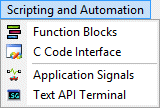

# Main Menu: Scripting and Automation

The Vehicle Spy **Scripting and Automation** menu contains tools to help automate Vehicle Spy tasks. The items in the menu are shown in Figure 1.

A brief description of each of the items in the Scripting and Automation menu can be found in Table 1, including links to help topics with additional information on each tool and feature.

**Table 1: Vehicle Spy Scripting and Automation Menu Items**

| Scripting and Automation Menu Selection     | Description                                                                                                                                                |
| ------------------------------------------- | ---------------------------------------------------------------------------------------------------------------------------------------------------------- |
| [Function Blocks](function-blocks/)         | Opens an interface where you can design three types of function blocks, permitting the automation of Vehicle Spy commands, data capture, or data playback. |
| [C Code Interface](c-code-interface/)       | Launches the C Code Interface, allowing custom C code projects to interface with Vehicle Spy.                                                              |
| [Application Signals](application-signals/) | Allows you to create and work with application signals, custom variables that can hold a variety of values and are used for many tasks.                    |
| [Text API Terminal](text-api-terminal.md)   | Opens the Text API Terminal, permitting third-party application control of Vehicle Spy using special text commands.                                        |
