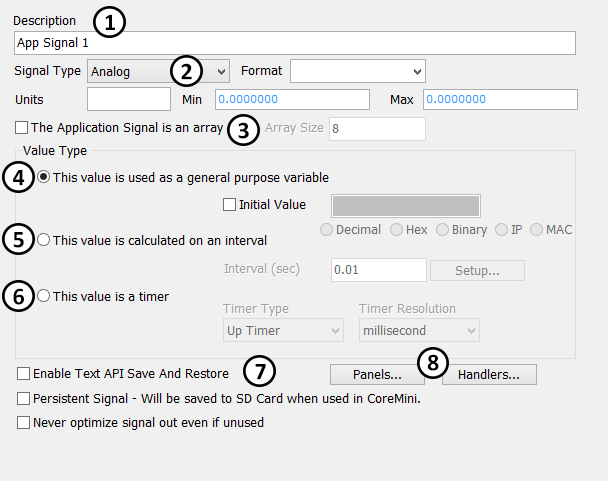

# Application Signals

Application signals store values in Vehicle Spy. They can hold values set by the user or be calculated signals that are not necessarily derived from network messaging. For example, a signal could be created where the value changes as if a function generator were attached to it. Application signals are setup under Scripting and Automation -> Application Signals. Vehicle Spy supports analog, digital, state encoded, and text type application signals.\
\
The left half of the Application Signals window is used to add, delete, and select application signals. Enter text in the Filter field to display only the application signal descriptions containing that text. Leave the Filter blank to display all application signals.\
\
Figure 1 shows the right half of the Application Signals window. The upper section  defines the application signal by giving it a name and a type. The Format and Units fields  are used in the same way as for building Message Signals. The checkbox at location  gives the option to create an application array. Application signal arrays work in a similar manner as with other programming languages. The Array Size determines how many elements are in the group. Each element is accessed by using an index number 0 to one less than the Array Size.\
\
You have a few options in the Value Type area that define when the signal is calculated.\
\
**This value is used as a general purpose variable** : This option is used when values are to be assigned in other parts of Vehicle Spy like function blocks and Java. The Initial Value option will set the application signal to the specified value when Start is clicked in Vehicle Spy.\
\
**This value is calculated on an interval** : Using this option, the application signal is calculated on a predefined interval. Click the Setup button to define the calculation with the Calculated Signal Editor.\
\
**This value is a timer** : This option can increment or decrement the value of an application signal in millisecond or microsecond increments.

**Other options**: The Text API Save and Restore option gives a way to save application signals to the PC. Click here for more help regarding how to save and restore application signals. The Persistent Signals option is used when working with CoreMini. When enabled, application signals are saved to the SD card keeping signal values over power cycles. The final option is to never optimize the signals out even is unused. This option is for VehicleScape DAQ and is used for internal values. To help track down where application signals are used in a setup, quick find buttons are available. The quick find buttons will hunt down applications signals used in Graphical panels and C Code interface. Click the corresponding button to search that section of Vehicle Spy.
