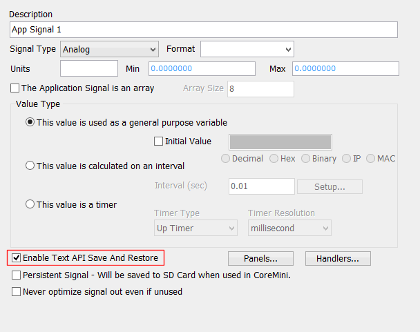

# Application Signals: Save and Restore

[Application Signal](./) values can be saved and retrieved later when "Enable Text API Save and Restore" is enabled for an application signal (Figure 1). To save all the Application Signal values that have saving enabled, send the [Text API](../../main-menu-tools/tools-options/options-text-api-options.md) command "appsave". To restore the application signal values, send the Text API command "apprestore". Saved values are stored in a separate file in the same directory as the saved vs3 file using the same file name, but with an "appini" extension.

