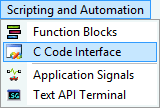
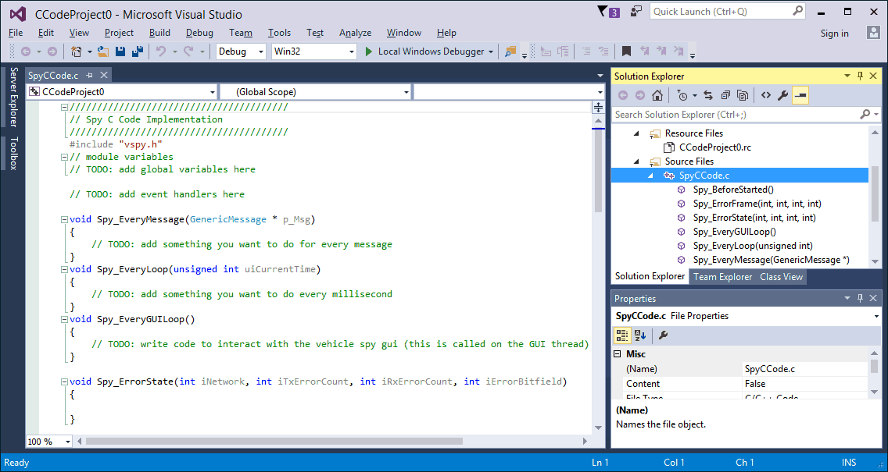

# C Code Interface

### Overview

The C Code Interface is a way to write C code that interacts with the communication protocols Vehicle Spy works with. The main advantage of using C code with Vehicle Spy as opposed to straight C code is that your code can access of the all the features of Vehicle Spy. Some examples of features you can access are message decoding, message reception, database decoding, display of signals and buffer capturing. The C Code Interface supports both event based and procedural step-by-step type C coding.

### Using the C Code Interface in Vehicle Spy

The C Code Interface is available from the [Scripting and Automation](../) menu in Vehicle Spy. This will open the C Code Interface view. The view consists of two main parts: a list of C code projects and an output window. Vehicle Spy supports multiple C code projects at once so you can add and remove projects to the list. The output window will display text written with a "printf" command in the C code project. You can also open the C code project by clicking the "Open Project in Visual Studio" button. When Vehicle Spy starts - all C code projects enabled (with a check box) will run.

### Design Philosophy of the C Code Interface

Instead of designing a proprietary scripting language that is C like, the C Code Interface uses standard C. Also, instead of a custom design environment or IDE we take advantage of the most powerful environment designed: Visual Studio ([https://visualstudio.microsoft.com/](https://visualstudio.microsoft.com)). The Visual Studio environment provides the most powerful development and debugging environment for C code today. The C Code Interface is designed to support the express edition or better.\
\
To make the C Code Interface work for the non-windows programmer, the C Code Interface automatically generates the projects and support files you need to interact with Vehicle Spy. Therefore, the typical C programmer who understands the basics can be very productive in this environment.\
\
The automatically generated code was designed for developer productivity. So, features like the Visual Studio intellisense works well to automatically find database messages, Vehicle Spy API's, and application signal environmental variables.

### Requirements

You must have Visual C++ installed. Currently, Visual Studio 2017, 2015, 2012, 2010, 2008, or 2005 are supported. The community edition is a [free download from the Microsoft web site](https://visualstudio.microsoft.com/vs/community/). The Visual Studio community edition is not as functional for [debugging](c-code-interface-object-names-debugging-and-common-mistakes.md) as the standard version and above (see Debugging for details). Please note that Visual Studio does not have to be installed **to run** C code projects that are already built. Simple examples can be [downloaded from the link here](https://cdn.intrepidcs.net/support/VehicleSpy/CCInterfaceExamples.rar).

### Protocol Support

The C Code Interface fully supports the CAN protocol. There is partial support for all protocols when working at the signal level. The main difference is that working at the bit and byte level of the other Vehicle Spy protocols is not supported. So, for example, receiving a message event for J1850 message works, but the MessageData structure is not filled in. The signals are filled in - however. In the future the C Code Interface will support more protocols. Contact our [technical support](https://intrepidcs.com/contact-us/) if you have requirements for other protocols.
