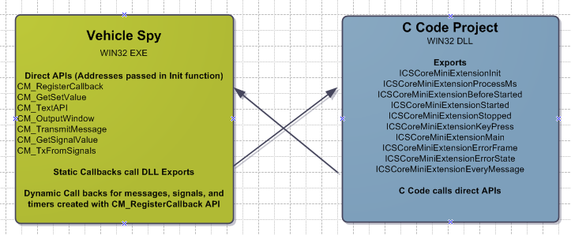

# C Code Interface: Advanced Topics

### What's Going on Behind the Scenes

For non-windows programmers, please skip this section. Otherwise, read on to learn how the C Code Interface interacts with Vehicle Spy.\
\
One benefit of the C Code Interface is the complexity it hides from the user. But behind the scenes, the C code project is a WIN32 DLL project which is dynamically loaded by Vehicle Spy. The DLL exports a set of standard functions, which Vehicle Spy calls to make everything work.\
\
A key function Vehicle Spy calls in the DLL is the Init function. In this function, Vehicle Spy passes a table of function pointers to the DLL. In this table are the addresses of all the Direct APIs the DLL uses to communicate to Vehicle Spy. The DLL stores these addresses and calls them as needed until unloaded.\
\
The next important function is the CM\_RegisterCallback. This function is called by the DLL code to inform Vehicle Spy of all the dynamic callbacks. The CM\_RegisterCallback function calls are inserted by Vehicle Spy when it generates vspy.c and vspy.h.\
\
For more information, please review the files in the C code Project in Visual Studio.

### Usage in Other Environments than Visual C++

The result of the C Code Interface is a DLL that plugs into Vehicle Spy. This DLL exports specific event functions and makes call back functions to Vehicle Spy. Therefore, any environment that can create a true win32 dll would work. However, in interest of support, we only officially support Visual C++ 2008 and above. Please contact our tech support if you wish to have this changed in the future.
