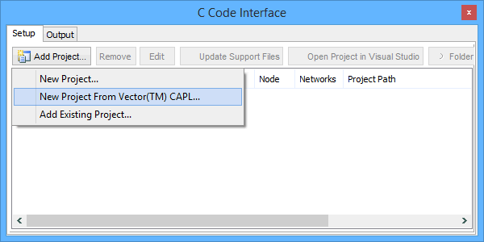

# C Code Interface: CAPL Conversion

Vehicle Spy includes a nice time saving feature that converts Vector CAPL to C code. This feature is found under [Scripting and Automation](../) -> [C Code Interface](./).\
\
Follow these steps to convert CAPL to C code for use in Vehicle Spy:

1. Verify a [platform and its databases](../../main-menu-setup/network-databases.md) are setup properly.
2. Open C Code Interface.
3. Click **Add Project** and select "New Project from Vector CAPL". (Figure 1)
4. Select the \*.CAN file to convert.\
   &#x20; Verify MS Visual Studio converts the file into a project without errors.
5.  Build the project in MS Visual Studio. (can use Ctrl+Shift+B)

    &#x20;  Verify the project builds without errors.\

6. Take Vehicle Spy online to run the converted and built CAPL project.\
   &#x20;  Results will depend upon what is in the CAPL project.\
   &#x20;  See results on the CCIF Output tab, [Messages view](../../main-menu-spy-networks/messages-view/), [Application Signals](../application-signals/), [Graphical Panels](../../main-menu-measurement/graphical-panels/), etc.

