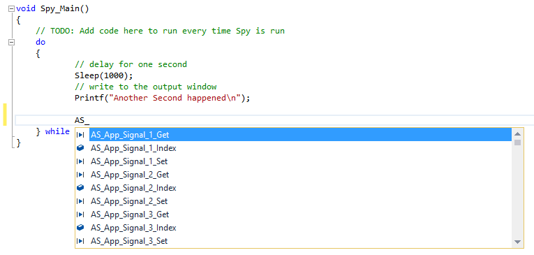

# Functions and Events: Application Signals

[Application signals](../../application-signals/) are variables used in Vehicle Spy to share data between various objects in Vehicle Spy. [Function Block scripts](../../function-blocks/function-blocks-types/script-type-function-block.md) and [Graphical Panels](../../../main-menu-measurement/graphical-panels/) can use these variables as well. The C Code Interface has support for accessing and changing these values. All application signals defined in your vs3 file have a set function, a get function, and an optional event function.  The set and get functions set either a number, normal text, or unicode (wide text).  All application signals start with the "AS\_" prefix.

For the event function, you can add these to your project setup by selecting the "Application Signal Events" tab in the C Code Module Setup as shown in Figure 2. Here, you can select any of the application signals for an event. This means Vehicle Spy will automatically call these functions when the application signal changes. Make sure to not use the \_Set function of the application signal in the change event to avoid a cascading situation.

