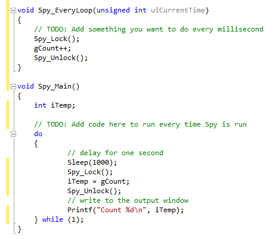

# Functions and Events: Common Functions and Events

There are certain functions for every C code module. Implementation of any of these is optional. All are event functions except for Spy\_Main(). Spy\_Main is like the main function of a standard C program. You can write your code as you would a separate application.

**Table 1: Timer Properties that can be Configured in Vehicle Spy**

| Function Name      | Called                                                    | Other Info                                                                                  |
| ------------------ | --------------------------------------------------------- | ------------------------------------------------------------------------------------------- |
| Spy\_EveryMessage  | Called for every message received.                        | Argument: A pointer to a generic message structure.                                         |
| Spy\_EveryLoop     | Called every Vehicle Spy main loop.                       | Argument: A unsigned int indicating the current OS millisecond timestamp.                   |
| Spy\_Stopped       | Called when Vehicle Spy is stopped.                       |                                                                                             |
| Spy\_Started       | Called when Vehicle Spy is started.                       |                                                                                             |
| Spy\_Main          | Called when Vehicle spy is run.                           | Runs as a separate program allowing non-event based code.                                   |
| Spy\_BeforeStarted | Called before Vehicle Spy starts. (allows abort of start) | Allows you to return 0 to stop Vehicle Spy from starting.                                   |
| Spy\_ErrorFrame    | Called for a CAN error frame on a CAN network.            | Arguments: Network, CAN error counters, and an Error bitfield.                              |
| Spy\_ErrorState    | Called when the error state changes for a CAN network.    | Arguments: Network, CAN error counters, and an Error bitfield.                              |
| Spy\_KeyPress      | Called for every key press.                               | Key Pressed and the Alt, Ctrl state field **MUST USE THE UPPER CASE VERSION OF KEY PRESS**. |

If you decide to share global data between the event functions and the main function you must use two functions called Spy\_Lock() before you access a variable and Spy\_Unlock() after you are done. These functions make sure the application that calls the events doesn't interfere with the Spy\_Main() application. It is important that the called Spy\_Lock is shortly followed by the unlock call. If you call the lock function without calling unlock it can lock up Vehicle Spy.

