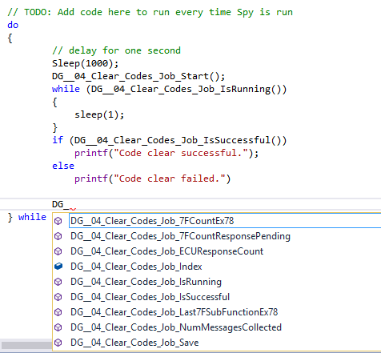

# Functions and Events: Diagnostic Jobs

The C Code Interface provides functions for interacting with Vehicle Spy [Diagnostic Jobs](../../../main-menu-spy-networks/diagnostics/diagnostics-setup.md). Diagnostic Jobs perform diagnostic operations on ISO14229, GMLAN or Keyword 2000. You can start, stop, save data, and see high level results directly from C.\
\
All diagnostic job related functions begin with the prefix "DG\_". The function then contains the diagnostic job name and finishes with the API name.  For example, if a diagnostic job was named "Test", the function to start it would be "DG\_Test\_Start()".  See the table and picture below for more details.

**Table 1: Diagnostic Job APIs Available**

| API                      | Description                                                                  |
| ------------------------ | ---------------------------------------------------------------------------- |
| IsRunning()              | Returns 1 if the diagnostic job is running.                                  |
| IsSuccessful()           | Returns 1 if the diagnostic job is triggered.                                |
| NumMessagesCollected()   | Returns the number of messages collected by the diagnostic job.              |
| Save()                   | Saves the diagnostic job data.                                               |
| Start()                  | Starts the diagnostic job.                                                   |
| Stop()                   | Stops the diagnostic job.                                                    |
| ECUResponseCount()       | Returns the number of responses from ECUs.                                   |
| TotalTimeAbs()           | The total time it took for the diagnostic job to complete.                   |
| Last7FSubFunctionEx78()  | The last 0x7F (negative response) that wasn't a response pending request.    |
| 7FCountEx78()            | This is the count of 0x7F negative responses excluding the pending requests. |
| 7FCountResponsePending() | This is the count of 0x7F 0x78 response pending requests.                    |

