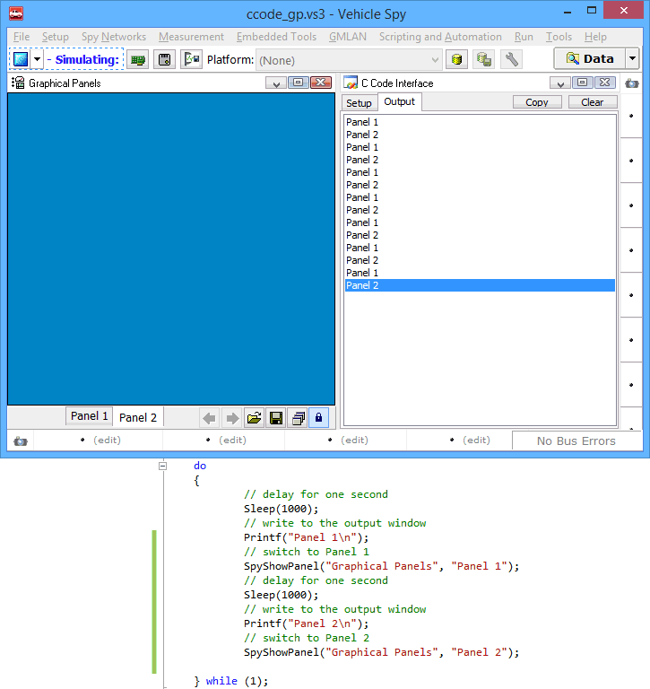

# Functions and Events: Graphical Panels

There are two functions that allow you to switch the current panel in a [Graphical Panel](../../../main-menu-measurement/graphical-panels/). These are SpyShowPanel and SpyShowPanelW. These function take two strings. The first string is the window name and the second is the panel you wish to show. The window string can be NULL or blank and the function will operate on the first graphical panel window visible. The difference between ShowPanel and ShowPanelW is that ShowPanelW takes unicode characters.

