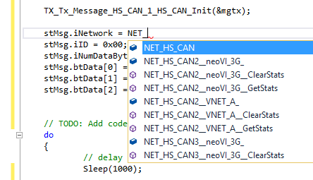

# Functions and Events: Network Indexes and Statistics

For each [Network](../../../main-menu-spy-networks/networks/) in Vehicle Spy there is an int variable. This variable is the number you use to reference a network. For example, the GenericMessage structure includes an iNetwork property. This indicates what network the message is from or will be transmitted to. All network indexes begin with the prefix NET\_.\
\
Each network has statistics that you can access. You can access the statistics for a network with the GetStats function. You can reset the statistics with the ClearStats function.

**Table 1: Statistics Available for a Network**

| Statistic Name | Data Type    | Description                                                                                                                                                       |
| -------------- | ------------ | ----------------------------------------------------------------------------------------------------------------------------------------------------------------- |
| iCount         | unsigned int | Count of messages on network.                                                                                                                                     |
| iRate          | unsigned int | Messages per second.                                                                                                                                              |
| dPercentUse    | double       | Current bus utilization.                                                                                                                                          |
| iMaxRate       | unsigned int | Maximum messages per second.                                                                                                                                      |
| dMaxPercentUse | double       | Maximum bus utilization.                                                                                                                                          |
| iErrorCount    | unsigned int | Number of errors on a network.                                                                                                                                    |
| iTxCount       | unsigned int | Number of messages transmitted on a network.                                                                                                                      |
| iErrorRate     | unsigned int | Errors per second.                                                                                                                                                |
| iTxRate        | unsigned int | Transmissions per second.                                                                                                                                         |
| iTxBufferFill  | unsigned int | Current network transmit buffer fill level.  This level indicates how many bytes are in the transmit buffer.  You can use this value to prevent buffer overflows. |
| iCANTxErrCount | unsigned int | Number of Transmit CAN errors.                                                                                                                                    |
| iCANRxErrCount | unsigned int | Number of Receive CAN errors.                                                                                                                                     |

