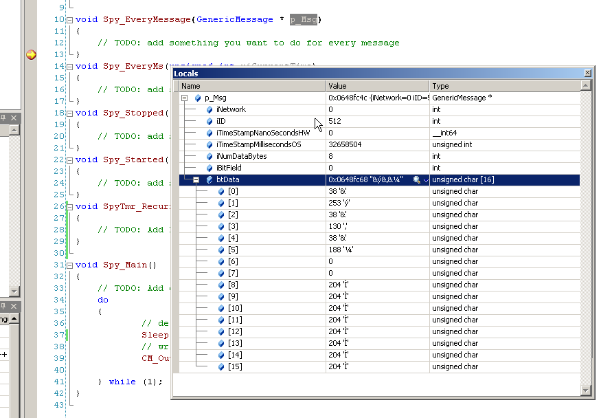

# C Code Interface: Object Names, Debugging, and Common Mistakes

### The Importance of an Object Name in a C Code Project

After your project is built you can run it over and over.  The project from that point, just like C, references every object in Vehicle Spy by name. So, if you change the name or delete an object in your Vehicle Spy setup that you use in a C project you will need to open Visual Studio and rebuild the project. This also means the C code projects can be reused across Vehicle Spy setups if you manage to keep the names the same for the objects you use.

### Debugging Your C Code

Visual Studio supports debugging two ways.  First, is it will launch Vehicle Spy every time you press run.  Another allows you to connect to a running copy of Vehicle Spy (called attach to process) Vehicle Spy will allow you to build and connect to it when Vehicle Spy is not online. Therefore, the most productive way is attaching to an existing Vehicle Spy. Only Visual Studio standard edition or better supports attaching to an existing Vehicle Spy.\
\
You cannot build your project when Vehicle Spy has the C code loaded. Therefore, you must go offline in Vehicle Spy in order to fully build your project.

### Common Mistakes for Building your project

1\) You created an event function, but did not implement it in SpyCCode.c. This causes a linker error. Make sure to copy the C function from the Event Code tab in the edit dialog for the C code module.

2\) You try to build the project while Vehicle Spy is online. The project is loaded. Go Offline in Vehicle Spy and then build the project.

