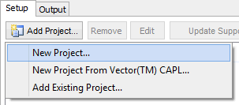
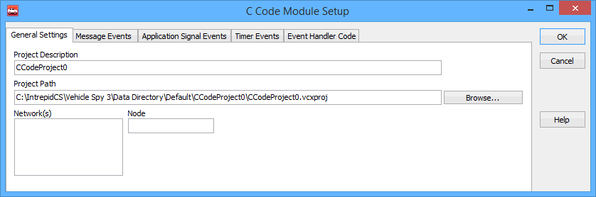

# Working with the C Code Interface

### Example Videos

Please review the example videos for an overview on how to use the C Code Interface.

### Adding a New Project

To add a new project, click on the "Add Project..." button (Figure 1), and a drop down will appear giving the options to add a new project, [convert from CAPL](c-code-interface-capl-conversion.md), or add an existing project.

If a new project is selected, a windows will pop up called "Add New C Code Project". Here a project name and a description is entered in. Vehicle Spy will then create a new base project and launch Visual Studio. Next the "Edit" button can be used to create events or the project can be worked with in Visual Studio. Make sure you build the DLL once before starting Vehicle Spy, otherwise, you will not have anything for Vehicle Spy to load - this will result in an error.

### Editing a Project

After a new project is created, events can created by clicking the "Edit" button in the C Code Interface.  In the setup dialog you can add event functions and change the name and description of the project.  For setup of the event functions please see the sections for [message](c-code-interface-functions-and-events/functions-and-events-message-objects.md), [application signal](c-code-interface-functions-and-events/functions-and-events-application-signals.md), and [timer](c-code-interface-functions-and-events/functions-and-events-timers.md) events. If you create event functions, make sure to manually copy the event handler code to your SpyCCode.c file. This will help you avoid a linker error when building your project.

### Your Work Goes Here: SpyCCode.c

The most important file in the Visual Studio project is the SpyCCode.c file. This file is where the C code you write is placed. In this file, you can implement all the event functions and the Spy\_Main() function. This file includes "vspy.h", which defines all the messages in your Vehicle Spy project. See the screen shot below.\
\
&#xNAN;_&#x4E;ote_: Advanced users can separate their project into as many C files as they would like.  This is recommended for very large projects. The SpyCCode.c file is the default C file and works well for small projects and beginners. So, if you know what you're doing in Visual Studio and want to have a separate C file for every event for better organization - go for it! In the end its all just C.

### Automatically Generated Files: vspy.c and vspy.h

Vehicle Spy automatically generates two files from your current Vehicle Spy setup. These include a header file (vspy.h) and an implementation file (vspy.c). These files can become inaccurate as you make changes to your Vehicle Spy setup. So, you will need to regenerate these as necessary during your development.  You can do this by clicking on the "Update Support Files" button in the C Code Interface view in Vehicle Spy.  These files will also be automatically updated every time you edit the C code project within Vehicle Spy.

