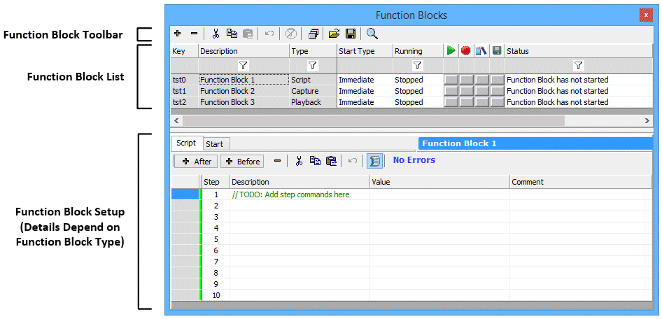

# Function Blocks

Function Blocks are a powerful feature providing customizable control over Vehicle Spy. Function Blocks allow you to write programmed scripts to automate many of Vehicle Spy's functions, define sophisticated methods of capturing data from a bus, or play back previously-collected or custom-defined messages in a specific manner.

Function Blocks are accessed through the [Scripting and Automation](../) menu.

### Function Block Types

There are three [types](function-blocks-types/) of function blocks, which are differentiated based on the primary job they are intended to perform: [script](function-blocks-types/script-type-function-block.md), [capture](function-blocks-types/capture-type-function-block/) and [playback](function-blocks-types/playback-type-function-block.md). You can define as many function blocks of as many different types as needed for your application, and all run simultaneously. Function blocks can also interact with each other: for example, you can use one function block to start or stop another.

### Hardware Scripting

Function blocks are also used to create custom programs to guide the operation of ICS hardware devices. A set of function blocks can be created to enable program logic of arbitrary complexity, compiled into a [CoreMini](../../main-menu-tools/utilities-coremini-console/), and then downloaded to a suitable Intrepid logger or other hardware device.

### Function Blocks Page Layout

The Function Blocks area is divided vertically into three screen regions (Figure 1):

* [Function Block Toolbar](function-blocks-toolbar.md): Found along the top of the window, the toolbar contains controls to let you add, delete and work with function blocks as a whole.
* [Function Block List](function-block-list.md): Provides a summary of each defined function block, showing its basic characteristics and its status. The list includes controls for starting and stopping each block. You can also rename function blocks from their default names here.
* [Function Block Setup Area](function-blocks-types/): This area contains settings that define the operation of the currently-selected function block. The parameters here are arranged into tabs, which differ based on function block type, though the [Start Tab](function-block-start-tab.md) is always present.

