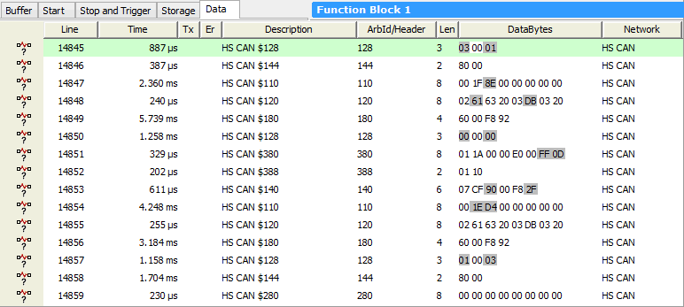

# Capture Type Function Block: Data Tab

### Overview

The **Data Tab** of a [Capture Type Function](./) Block does not contain settings, but rather is a display area where you can observe the messages that are being captured as the function block is running. If a [filter](capture-type-function-block-filter-tab.md) has been defined, then only the messages passing the filter will be shown.

An example of the **Data Tab** as it might appear while running a capture block is shown in Figure 1. Notice that highlighting of changing byte data is shown, as in the [Messages View](../../../../main-menu-spy-networks/messages-view/messages-view-buffer-display/) display.

