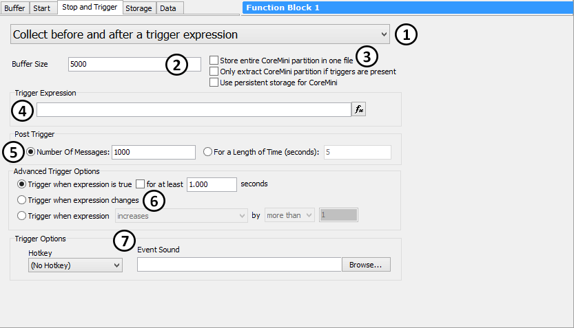

# Capture Type Function Block: Stop and Trigger Tab

### Overview

The **Stop and Trigger Tab** of a [Capture Type Function Block](./) is where the most important options are set for the block. It is here that we specify the primary method of data collection, determining when and how data will be captured. We also tell Vehicle Spy how much data we want to store, set trigger options for trigger-based captures, and set miscellaneous options for CoreMini standalone logging.

This tab contains a number of parameter sets, some of which are displayed or hidden depending on what is selected in the collection mode drop-down box. Figure 1 shows an example of the **Stop and Trigger Tab** as it appears with the **Collect before and after a trigger expression** collection method selected (which we chose since this method uses all of the available settings).

### Collection Method

This drop-down box (Figure 1:) is the most important setting for any capture block, as it determines its basic behavior. Table 1 summarizes the five collection methods, and also shows which sets of parameters are enabled for each method.

**Table 1: Sample applications of capture type function blocks**

| Collection Method                             | Description                                                                                                                                                                                                                                                                                                                                                                                                                                                                                                                                                                               | Buffer Size                                                             | CoreMini Options                                                        | Trigger Expression                                                      | Post Trigger Options                                                    | Advanced Trigger Options                                                | Trigger (Control and Notification) Options                              |
| --------------------------------------------- | ----------------------------------------------------------------------------------------------------------------------------------------------------------------------------------------------------------------------------------------------------------------------------------------------------------------------------------------------------------------------------------------------------------------------------------------------------------------------------------------------------------------------------------------------------------------------------------------- | ----------------------------------------------------------------------- | ----------------------------------------------------------------------- | ----------------------------------------------------------------------- | ----------------------------------------------------------------------- | ----------------------------------------------------------------------- | ----------------------------------------------------------------------- |
| Collect in a circular buffer                  | Captures data in a buffer; when the buffer fills, new messages overwrite the old ones. This continues until some action is taken to save the current data in the buffer.                                                                                                                                                                                                                                                                                                                                                                                                                  |  |  |                                                                         |                                                                         |                                                                         |                                                                         |
| Collect in a one-shot buffer                  | Fills the buffer with captured data one time.                                                                                                                                                                                                                                                                                                                                                                                                                                                                                                                                             |  |  |                                                                         |                                                                         |                                                                         |                                                                         |
| Collect before and after a trigger expression | Data is collected in a circular buffer until a trigger expression evaluates as **True**. After the trigger, additional data is captured, allowing data surrounding the event to be saved.                                                                                                                                                                                                                                                                                                                                                                                                 |  |  |  |  |  |  |
| Collect before and after a manual trigger     | 
Data is collected in a circular buffer until a manual trigger event, after which additional data is captured. A manual trigger can be initiated in a number of ways:
<ul><li>Clicking the <a href="../../function-block-list.md">Trigger button</a> for the capture block.</li><li>Using a <a href="../script-type-function-block-commands/script-type-function-block-command-function-block-action.md">Function Block Action command</a> within a <a href="../script-type-function-block.md">function block script</a>.</li><li>Pressing an assigned hotkey (see below).</li></ul> |  |  |                                                                         |  |                                                                         |  |
| Stop on expression                            | 
Data is collected continuously until a trigger expression evaluates as <strong>True</strong>.  <strong>Note:</strong> This collection method is not valid for capture blocks that will be compiled and run as <a href="../../../../main-menu-tools/utilities-coremini-console/">CoreMinis</a>.
                                                                                                                                                                                                                                                                               |                                                                         |  |  |                                                                         |                                                                         |                                                                         |

### Buffer Size

This box (Figure 1:) specifies the number of messages to be captured in the buffer. It is present for all collection methods except for **Stop on expression** (which doesn't use a fixed buffer size). For trigger-based methods, the data in this buffer is conceptually split into the **pre-trigger buffer** and **post-trigger buffer** sections, as described below.

### CoreMini Options

These three options (Figure 1:), which are present for all collection methods, configure capture block operation for [CoreMini](../../../../main-menu-tools/utilities-coremini-console/) standalone logging:

* **Store entire CoreMini partition in one file:** This option saves the buffer as one large file instead of breaking it into multiple smaller ones.
* **Only extract CoreMini partition if triggers are present:** When working with pre/post triggers and partition logging, the last partition always has data. This option suppresses extraction of the last partition if no triggers conditions were met. Trigger conditions are marked by a message sent on the neoVI device network.
* **Use persistent storage for CoreMini:** Persistent storage is a storage area on the micro SD card that does not wrap when the card fills. This options uses that space to prevent older data from being overwritten.

### Trigger Expression

This option appears for the two collection methods that are dependent on an expression being evaluated (Figure 1:). Press the  button to open the [Expression Builder](../../../../../shared-features-in-vehicle-spy/shared-features-expression-builder.md), where you can define the trigger expression.

### Post Trigger Options

For collection methods where data is collected both before and after a trigger, this area is where we specify what should be done after the trigger occurs (Figure 1:). There are two main options here:

* **Number Of Messages:** A specific number of messages is collected after the trigger.
* **For a Length of Time:** Data is collected after the trigger occurs for the number of seconds specified.

In both cases, the data collected after the trigger replaces the oldest data in the buffer, which means that the size of the pre-trigger buffer is equal to the **Buffer Size** figure less the number of messages collected after the trigger. For example, if the buffer size is set to 5,000 messages and **Number Of Messages** is set to 1,000, then the buffer will contain 4,000 messages before the trigger and 1,000 messages after the trigger (assuming enough time elapsed to collect 4,000 messages before the trigger occurred).

### Advanced Trigger Options

The **Collect before and after a trigger expression** collection method offers additional options (Figure 1:) for determining how Vehicle Spy determines that a triggering event has occurred:

* **Trigger when expression is true:** Trigger when the expression evaluates as **True**. This is the default option. You can optionally set a period of time over which the expression must continuously evaluate as **True** for the trigger to activate.
* **Trigger when expression changes:** Trigger when the expression changes from its previous value.
* **Trigger when expression increases / decreases / changes:** Allows you to more precisely tailor the conditions under which the trigger should occur.

### Trigger (Control and Notification) Options

These settings (Figure 1:) provide additional input and output options for trigger-based collection:

* **Hotkey:** You can select a [hotkey](../function-blocks-hotkeys.md) (function key, key combination or joystick button) that will trigger collection when it is pressed.
* **Event Sound:** Select a .wav sound file, and it will be played when collection is triggered. This is useful for informing a user that the trigger has occurred when triggering based on an expression.
