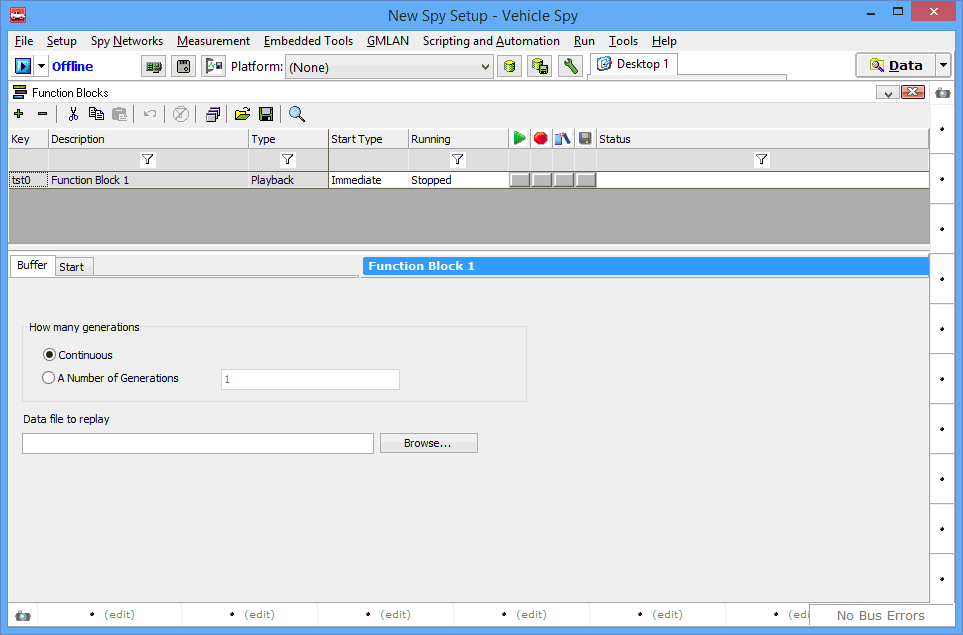

# Playback Type Function Block

### Overview

Playback type [function blocks](../) (sometimes called _playback blocks_) allow you to transmit the messages in a Vehicle Spy buffer file. The messages in the file are actually "played back" on the network in real time based on their timestamps. Typically you will play back a buffer that has been previously captured on a network, possibly using a [capture block](capture-type-function-block/). You can modify the buffer data if necessary, to test specific problems or scenarios.

### Creating a Playback Block

Create a new playback block by clicking the  button on the far left of the [function block toolbar](../function-blocks-toolbar.md), and then choosing **Playback** from the popup menu. Vehicle Spy will create a default playback block for you as shown in Figure 1, with the **Buffer Tab** selected.

### Renaming a Playback Block

Like any function block, a new playback block appears in the [function block list](../function-block-list.md) near the top of the function blocks area. You can rename the function block by double-clicking on the default (**Function Block 1**) and entering a more descriptive name.

The name entered in the function block list also appears in blue in the function block setup area for greater clarity.

### Buffer Tab

Playback blocks are much simpler than [script type](script-type-function-block.md) or [capture type function blocks](capture-type-function-block/), and contain only two tabs. One of these is the [Start Tab](../function-block-start-tab.md) common to all function block types, where you specify the block's **Start Type** and related options. The other is the **Buffer Tab**, which you can see in Figure 1. This tab is itself quite straightforward, containing only a couple of parameters.

### Generations

This option controls how many times the buffer is played back:

* **Continuous:** The buffer is continuously played back until the script is stopped.
* **A Number of Generations:** The buffer is played back for the number of times specified (default 1).

### Data file to replay

Click the **Browse...** button to launch the standard Windows file picker dialog box, then navigate to the file you want to play back and select it.

### Applications

Playback blocks are generally used for diagnostic purposes. Usually live data is saved from a network and then played back, possibly after being altered.

### Playing Back a Captured Buffer

A common use of a playback block is to first collect network traffic and then play it back to test a particular network, ECU or set of ECUs. Here is a sample scenario:

1. A problem is found with the cluster on a durability vehicle.
2. Vehicle Spy is used to collect all the data on the vehicle network.
3. In the lab, Vehicle Spy is set up with a playback function block, and used to play back the collected data to the cluster on a test bench.
4. The vehicle problem is replicated on the bench so it can be addressed.

### Customizing a Buffer for Playback

Buffers are stored in the standard **.csv** text format and can be edited in a text editor or using a spreadsheet program such as Microsoft Excel. Be sure when modifying the data not to alter the basic structure of the file or remove any of header lines, such as those containing network, protocol and baud rate information. After making your changes, save the file and then use it in the playback block.

One example of customization would be changing the data file to alter message timing. This could be useful if you wanted to isolate a particular message that was causing issues.
