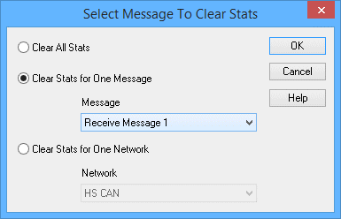
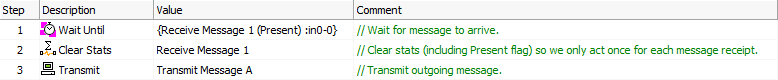

# Script Type Function Block Command: Clear Stats

### Command Description

This command resets the current statistical information for received messages.

It has no effect on transmit message statistics.

### Value Field Parameters

Double-click the **Value** field for the command to open a dialog box that will allow you to select which stats you wish to clear (Figure 1). The three choices are:

* **Clear All Stats:** Clear statistics for all messages.
* **Clear Stats for One Message:** Clear statistics for a single message, which should be selected from the **Message** drop-down box just below. (This option is illustrated in Figure 1.)
* **Clear Stats for One Network:** Clear statistics for a network, selected from the adjacent **Network** drop-down box.

### Example

One possible use for the **Clear Stats** command is to [reset the **Present** flag on a message](../script-type-function-block-resetting-the-present-flag.md) to ensure that actions dependent on receipt of a message trigger only once each time the message arrives. In the example in Figure 2, the script waits until **Receive Message 1** arrives before taking any further action (Step 1). Once it is received, **Clear Stats** is used to clear the **Present** flag (Step 2). Then an outgoing message, **Transmit Message A**, is sent (Step 3) and the function block automatically resumes back at Step 1. Without clearing the **Present** flag, it would still have the value **True** and **Transmit Message A** would be sent on the next iteration, the process repeating indefinitely.

**Important Note:** Using **Clear Stats** in this manner resets not only the **Present** flag, but all other information related to the message, including its data. If you will need to work with other properties or data in the message, it is recommended that you instead use the more precise [Set Value option](../script-type-function-block-resetting-the-present-flag.md) for clearing the flag.

