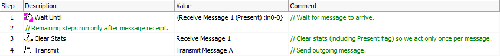

# Script Type Function Block Command: Comment

### Command Description

Comments are used to describe the behavior of other commands or portions of a function block script. They are useful for making a script more readable and can be helpful in debugging. Comments are always shown in green for greater visibility.

While listed with other commands, they do not actually cause Vehicle Spy to take any action, and are simply skipped when encountered. Comments are also added to a script in a special way: you enter them in the special **Comment** column, rather than selecting **Comment** in the **Description** column.

There are two types of comments: those that document other commands, and standalone comments that appear by themselves on a line. Comments on other commands are typically short and explain what that step does; examples can be seen in steps 1, 3 and 4 in Figure 1. Standalone comments describe or visually separate blocks of commands in large scripts, like step 2 in the figure.

### Entering a Comment on Another Command

To add a comment to another command, simply enter it into the **Comment** field of that command. The "//" prefix visually separates the comment and is added automatically by Vehicle Spy.

### Entering a Standalone Comments

To create a standalone comment, enter it into the **Comment** field of a blank step. When you are finished, Vehicle Spy will add the "//" prefix and then move the comment over to the **Description** field, showing that the step is only a comment with no other command. Note that if you want to edit the comment, double-click in the **Comment**field for the step, not the **Description** field.

If you edit the **Description** column of a step that has a standalone comment in it in order to choose a different command, then rather than deleting the existing comment, Vehicle Spy will move it to the **Comment** column for you.

### Value Field Parameters

None.
