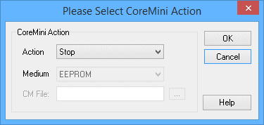

# Script Type Function Block Command: CoreMini Action

### Command Description

This command allows various actions to be taken with [CoreMini](../../../../main-menu-tools/utilities-coremini-console/) scripts that are compiled and run on Intrepid hardware independently of the PC and Vehicle Spy.

### Value Field Parameters

Double-clicking in the **Value** field brings up a special dialog box where parameters for this command can be selected. The initial appearance of this dialog box is shown in Figure 1.

### CoreMini Action

This is the primary parameter for the command, specifying what action the command should take:

* **Stop:** Stops the CoreMini if it is currently running.
* **Start:** Starts the CoreMini if it is not running. Selecting this option enables the **Medium** parameter, described below.
* **Download (USB):** Downloads the specified CoreMini (**.vs3cmb**) file over USB to the ICS hardware. This option enables the **Medium** and **CM File** parameters.

### Medium

Selects the storage medium for the **Start** and **Download (USB)** actions:

* **EEPROM:** Internal flash memory.
* **SD Card:** An SD card inserted into the device.

### CM File

This option is enabled for the **Download (USB)** action. Press the  button to bring up a Windows file selection dialog box. Navigate to the desired CoreMini (**.vs3cmb**) file and select it; the name will be shown in the adjacent text box.
