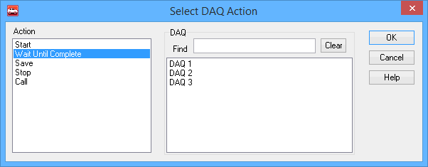

# Script Type Function Block Command: DAQ Action

### Command Description

The **DAQ Action** command allows a script type function block to control the operation of a [VehicleScape DAQ](../../../../main-menu-measurement/vehiclescape-daq/) setup.

### Value Field Parameters

Double-click in the **Value** field for the command to launch a dialog box to set its parameters (Figure 1). There are two to select: the action to take and the DAQ configuration to act upon.

### Action

Specifies what the script should do:

* **Start:** Start the selected DAQ job if it is not running.
* **Wait Until Complete:** Pause the function block at this step until the DAQ job is finished.
* **Save:** Save the data collected from the DAQ setup.
* **Stop:** Stop the DAQ selected if it is currently running.
* **Call:** Start the DAQ job and then wait until it is finished. (This combines the **Start** and **Wait Until Complete** actions.)

### DAQ

Allows you to select the DAQ to which the selected action should be applied. The DAQ jobs in the current Vehicle Spy setup will be listed in the white box on the right; simply click the one you want before pressing the **OK** button.\
\
The **Find** box allows you to more easily find the right DAQ in setups where there are many. Type a string in the box to filter the list of DAQ configurations shown in the selection box, so that only those that match appear. Press **Clear** to resume showing all DAQ setups again.
