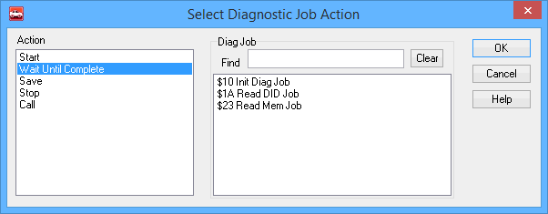

# Script Type Function Block Command: Diag Job Action

### Command Description

The **Diag Job Action** command allows a function block script to control diagnostic jobs created in the Diagnostics feature of Vehicle Spy.

### Value Field Parameters

Double-click in the **Value** field to bring up a dialog box to set command parameters (Figure 1). There are two parameters to select: the action to take and the diagnostic job to work with.

### Action

Specifies the action that the script should take:

* **Start:** Start the selected diagnostic job if it is not running.
* **Wait Until Complete:** Pause the function block at this step until the diagnostic job is finished.
* **Save:** Save the data collected by the diagnostic job.
* **Stop:** Stop the selected diagnostic job if it is currently running.
* **Call:** Start the diagnostic job and then wait until it is finished. (This combines the **Start** and **Wait Until Complete** actions.)

### Diag Job

Allows you to select the diagnostic job that this command should act upon. The diagnostic jobs in the current Vehicle Spy setup will be listed in the white box; simply click on the one you want and then press the **OK** button.\
\
The **Find** box allows you to more easily locate the right job in large setups. Type a string in the box to filter the list of diagnostic jobs shown in the selection box, so that only those that match the entered string appear. Press **Clear** to resume showing all diagnostic jobs again.
