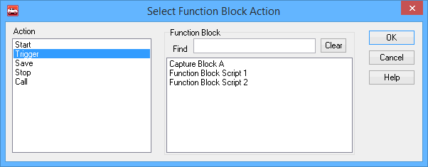
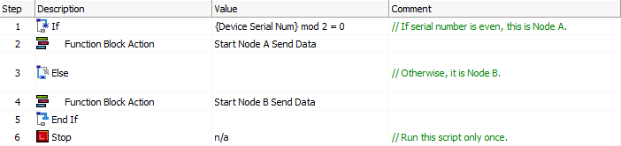

# Script Type Function Block Command: Function Block Action

### Command Description

The Function Block Action command allows one function block script to control the operation of another.

### Value Column Parameters

Double-click the **Value** column to bring up a dialog box to define command settings (Figure 1). There are two parameters to select: the action to take, and the function block to apply the action to.

### Action

Specifies the action to be taken:

* **Start:** Start the selected function block if it is not running.
* **Trigger:** Trigger a [Capture Type Function Block](../capture-type-function-block/) that is currently waiting to be triggered. To use this option you must select a capture type block, and its collection method must be either **Collect before and after a trigger expression** or **Collect before and after a manual trigger** as specified in the [Stop and Trigger Tab](../capture-type-function-block/capture-type-function-block-stop-and-trigger-tab.md).
* **Save:** Save the data collected by a capture block.
* **Stop:** Stop the selected function block if it is currently running.
* **Call:** Start the function block and then wait until it is finished.

### Function Block

The function block upon which to perform the action. All function blocks in the current setup will be listed in the large white box at bottom right; select one and then press the **OK** button.

The **Find** box allows you to more easily find the right function block in setups where there are many. Type a string in the box to filter the list of function blocks shown in the selection box, so that only those that match the entered string appear. Press **Clear** to resume showing all function blocks again.

### Example

Figure 2 shows a "real world" example of how the **Function Block Action** command can be used. The setup in question is designed to run in a [CoreMini](../../../../main-menu-tools/utilities-coremini-console/) on an ICS hardware device with two nodes. In addition to the script shown, the setup has two others: **Node A Send Data**, designed to run in Node A of the device, and **Node B Send Data**, designed to run on Node B. These two scripts have their [Start Type](../../function-block-start-tab.md) set to **Manual** so they do not run when the device is turned on, while the script in Figure 2 runs immediately. It begins by querying the device's serial number; if it is even, this means the script is running on Node A, so the script starts **Node A Send Data**; otherwise it starts **Node B Send Data**. The startup script then stops.

