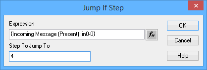

# Script Type Function Block Command: Jump If

### Command Description

This command evaluates a supplied expression, and if it is **True**, immediately directs Vehicle Spy to continue the script at the step number provided.

**Jump If** differs from **Jump To** in that the jump only occurs if the expression is **True**. It can be used to conditionally control the flow of execution of a function block script, such as skipping certain commands based on a signal value.

Note that excessive use of **Jump If** and **Jump To** commands can make a script difficult to understand. In many cases, an [If / Else / Else If / End If](script-type-function-block-commands-if-else-else-if-end-if.md) structure can accomplish the same task with code that is easier to understand.

### Value Field Parameters

Double-clicking the **Value** field brings up a dialog box (Figure 1) to set two command parameters: the expression to evaluate, and the step to branch to if the expression is **True**.

