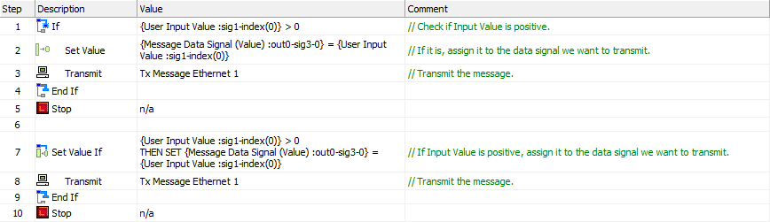
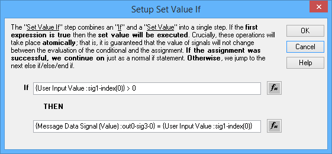

# Script Type Function Block Command: Set Value If

### Command Description

The **Set Value If** command combines the [If](script-type-function-block-commands-if-else-else-if-end-if.md) and [Set Value](script-type-function-block-command-set-value.md) commands in a special way. An expression is evaluated, as it would be in an **If** command, and then the following happens based on the result:

* **Expression is True:** The **Set Value** statement is executed, and then the commands following the **Set Value If** are _also_ executed, just as would have occurred if this had been a normal **If** statement that evaluated as **True**.
* **Expression is False:** The **Set Value** statement is _not_ executed, and all the following commands are skipped until the next **Else**, **Else If** or **End If** statement is seen, just as if this had been a normal **If** statement that evaluated as **False**.

From a logical standpoint, then, there is no difference between one **Set Value If** command and separate **If** and **Set Value** commands. In Figure 1, Steps 1 to 5 and Steps 7 to 10 do basically the same thing.

However, there is _one important difference:_ the **Set Value If**command guarantees that the **If** part of the command and the **Set Value** part will be executed _atomically._ This means that they are executed together, and it is guaranteed that if the expression is **True**, no signal values will change before the assignment operation takes place.

The script in Figure 1 checks if an application signal called **User Input Value**is positive in step 1, and if so, assigns it to a transmit message signal in step 2 before sending the message. The intent, then, is only to send the data if**User Input Value** is positive. It is possible, however, that this value might have changed between these two steps (perhaps by a differentfunction block script) which could result in transmitting the message with a negative value. Using a **Set Value If** statement instead, as in step 7, ensures that this will not happen.

Note that the same rules for combining an **If** statement with the [Else](script-type-function-block-commands-if-else-else-if-end-if.md), [Else If and End If](script-type-function-block-commands-if-else-else-if-end-if.md) commands also apply to **Set Value If.** You must have an **End If** to match each **Set Value If**. The use of **Else** and **Else If** is optional, and if present, they are used in the same way as with an **If** statement.

### Value Field Parameters

Double-click the **Value** field for the command to launch a specialized window for it, where you can enter both the evaluation (**If**) expression and assignment (**Set Value**) expression using the [Expression Builder](../../../../../shared-features-in-vehicle-spy/shared-features-expression-builder.md). Figure 2 shows this window illustrating the expressions used for the command in step 7 of Figure 1.

