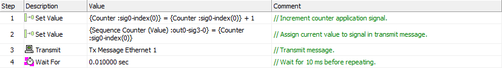
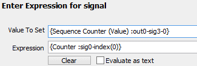

# Script Type Function Block Command: Set Value

### Command Description

Use this command to assign a value to a signal, such as a [message signal](../../../../main-menu-spy-networks/message-editor/message-signals/) or an [application signal](../../../application-signals/).

### Value Field Parameters

The assignment takes place using the [Expression Builder](../../../../../shared-features-in-vehicle-spy/shared-features-expression-builder.md). Launch it by double-clicking in the **Value** cell for the **Set Value** command. Then enter the signal you want to assign in the **Value To Set** field, and the expression for the value to assign in the **Expression** field.

If the signal is a [Physical IO property](../../../../../shared-features-in-vehicle-spy/shared-features-expression-builder.md#physical-io-properties) then MISC IO reporting in 3G Explorer must be enabled in the hardware.

### Example

Figure 1 shows a simple script that transmits an Automotive Ethernet message using a sequential counter. The first **Set Value** command increments the **Counter** application signal. The second assigns that signal's current value to the **Sequence Counter** signal within the transmit message **Tx Message Ethernet 1**, and sends the message. The script waits for 10 milliseconds, and then repeats.

Figure 2 shows how the **Set Value** statement in step 2 is set up in the Expression Builder.

