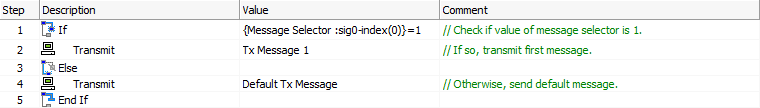
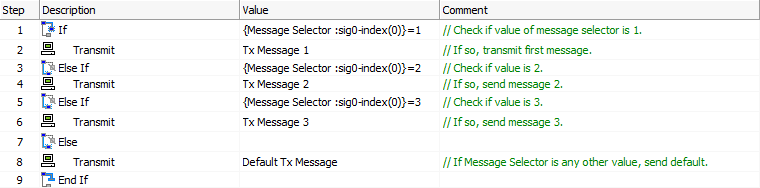
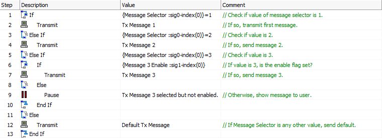

# Script Type Function Block Commands: If, Else, Else If, End If

### Overview

The **If**, **Else**, **Else If** and **End If** commands are used to implement control logic structures within Function Block scripts. They are designed to work together to allow you to precisely manage what your script does based on signal values or events.

If you have a background in programming, you are likely familiar with these commands, and they behave in much the same way that you would expect them to. For reference, the commands are fully described individually below.

### If Command

Each logical control structure must begin with an **If** command. The **Value** parameter for this command is a conditional expression set up using the [Expression Builder](../../../../../shared-features-in-vehicle-spy/shared-features-expression-builder.md), and can be anything that returns a **True** or **False** value. Depending on this result, Vehicle Spy acts as follows:

* If the expression evaluates as **True**, then all commands following the **If** statement are executed, up until the next matching **Else If**, **Else** or **End If** statement.
* If the expression evaluates as **False**, then all commands following the **If** statement are skipped, up until the next matching **Else If**, **Else** or **End If** statement is seen.

Normally a conditional expression returns a value of **1** for **True**, or **0** for **False**. If a numeric value is returned other than **0** or **1**, it will also be considered **True**.

### Else Command

Delimits the commands executed when an **If** or **Else If** statement is **True**, and begins those executed when the preceding **If** or **Else If** is **False**.

The **Else** statement can be used just with an **If** and **End If** to provide simple "either-or" logic, or with **Else If** commands to allow multiple conditions to be tested. When used with **Else If**, the **Else** command usually appears last, and the commands after it are run only if all preceding **If** and **Else If** statements evaluate as **False** (see example below).

The **Else** command has no **Value** parameters.

Only one **Else** command should appear in a single **If / End If** control structure.

### Else If Command

This command combines an **Else** and **If** statement. It marks the end of the commands executed in a preceding **If** or **Else If** block, like an **Else** command does, but it also starts a new set of commands to be executed if the condition specified in the **Value** field is true.

Multiple **Else If** commands can be used, and they can be used with or without an **Else**command. This is commonly done to allow a different action to be taken for each of a variety of values in a signal.

### End If Command

This command ends a logical control structure. A single **End If**command must appear in the script to match each **If** command, irrespective of the number of **Else** or **Else If** statements that may be present.

The **End If** command has no parameters.

### Nesting Control Structures

It is possible to create more complex logic in a function block by nesting control structures, which means putting an **If / Else / Else If / End If** structure within another one. All the rules above must be followed for each structure.

By default, Vehicle Spy will associate **Else**,**Else If** and **End If** commands with the most recent (innermost-nested) control structure. It will indent the commands to make it easier for you to keep the structures separate and understand the control logic you have created.

### Examples

Below are a few examples showing typical uses of these commands.

### If / End If

This is the simplest structure, executing one or more commands if an expression is true. The example in Figure 1 tests if a **Message Selector** signal equals **1**, and if so, it transmits**Tx Message 1**; otherwise, it does nothing, and execution continues after the End If statement.

### If / Else / End If

Figure 2 shows a modification of the script in Figure 1, which transmits **Tx Message 1** if **Message Selector** is equal to **1**, and otherwise sends a default transmission, **Default Tx Message**.

### If / Else / Else If / End If

In Figure 3 we have further modified the script to allow multiple values of **Message Selector** to be tested, with the appropriate message transmitted based on its value. If it carries a value other than the ones we are testing for, the default message is sent.

### If / Else / Else If / End If with Nested If / Else / End If

In Figure 4 we have added a second construct nested within part of the original structure: Steps 6 through 10 in Figure 4 replace Step 6 in Figure 3. This extra logic activates only if **Message Selector**'s value is **3**. If it is, we check another flag called **Message 3 Enable**; only if that is **True** do we transmit **Tx Message 3**. If it is not, we pause and display an error message to the user.

Notice that Vehicle Spy has indented Steps 6 to 10 to make it easier to see that they are nested within the original commands.

