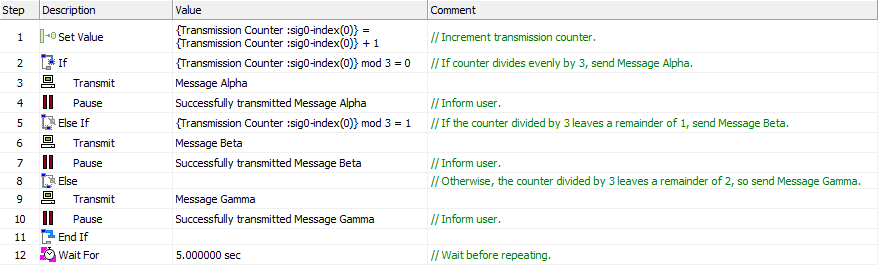
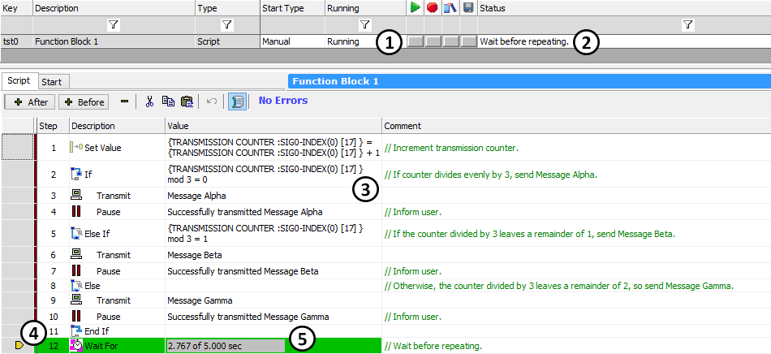
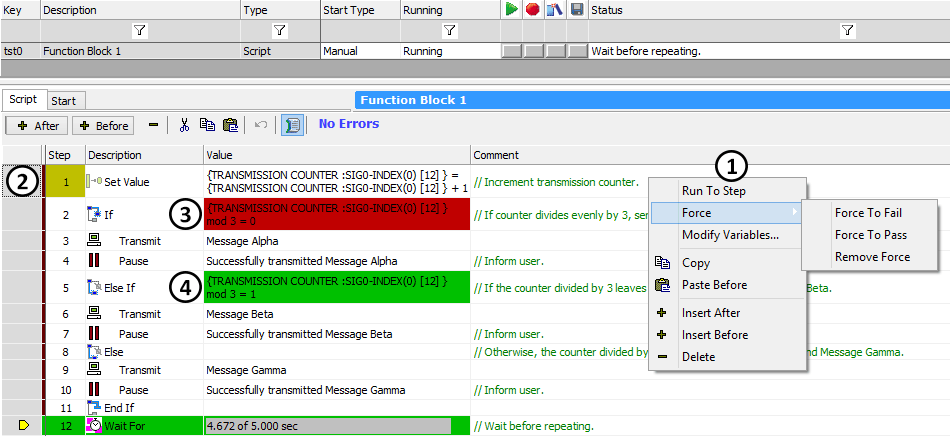
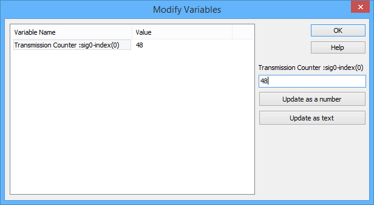

# Script Type Function Block: Debugging Tools

### Debugging

Function block scripts are programs, and like all programs, occasionally may need to be debugged. The more complicated the script, the more difficult it is to fully understand its behavior, making it more likely that debugging will be required.

Fortunately, Vehicle Spy provides a number of tools to help you debug your scripts. These can be broken down generally into two categories: real-time information displays, and specific debugging tools.

For the purposes of illustration, we will use the example script shown in Figure 1. It transmits three messages (**Alpha**, **Beta** and **Gamma**) in sequence using a counter before repeating. See the comments within the script for more details.

### Real Time Displays

Figure 2 shows the sample script we are using as it appears while running with the script displayed. Several elements of information can be seen here to help you understand what is going on:

* **Running:** The **Running** column in the [Function Block List](../function-block-list.md) indicates if the script is running (as in this screenshot), stopped or halted (Figure 2:).
* **Status:** This column displays the current status of the script. In this case it is showing the comment from step 12, since that's the step that was executing when the screenshot was taken (Figure 2:).
* **Variable Values:** Commands that involve setting or evaluating expressions will show you their current values in the **Value** column. For example, in steps 1 and 2, VSpy is showing that the value of the **Transmission Counter** application signal is currently **17** (Figure 2:). You can also see this in step 5.
* **Execution Pointer:** Vehicle Spy shows you the current step being executed with a yellow pointer in the far left column, and also by highlighting the current step in green (Figure 2:).
* **Time Bargraphs:** Commands like **Wait For** that involve having Vehicle Spy pause for a period of time show the elapsed and remaining time in the **Value** field using a gray horizontal bar that fills from left to right (Figure 2:).

### Debugging Tools

Several debugging tools in Vehicle Spy allow you to go beyond observing your script and interact with it directly to better understand what is happening in every step. Here are a few of the available options, several of which are displayed in Figure 3.

### Stop and Pause Commands

The [Stop](script-type-function-block-commands/script-type-function-block-command-stop.md) and [Pause](script-type-function-block-commands/script-type-function-block-command-pause.md) commands can help you debug by interrupting execution at critical points, and Pause can also display variable values. However, these tools are somewhat inconvenient, as they require actually changing the script.

### Breakpoints

A breakpoint allows you to tell Vehicle Spy to stop execution at a particular step. To set a breakpoint, select the step where you want to stop, then right-click in the script area to bring up the context menu (Figure 3:) and choose **Run To Step**. The selected step will have its number highlighted in gold (Figure 3:), and when the script is run, it will stop at (but before executing) that step. To resume execution, just press the  button for the script in the [Function Block List](../function-block-list.md).

You can have multiple breakpoints in a script. Each time a breakpoint is encountered as the script is run, it is removed and execution stops at the next one.

### Conditional Logic Forcing

Script commands that evaluate conditional expressions to decide which commands to execute next (such as [If](script-type-function-block-commands/script-type-function-block-commands-if-else-else-if-end-if.md), [Else If](script-type-function-block-commands/script-type-function-block-commands-if-else-else-if-end-if.md), [Jump If](script-type-function-block-commands/script-type-function-block-command-jump-if.md) and [Wait Until](script-type-function-block-commands/script-type-function-block-command-wait-until.md)) can have their evaluations forced to either **True** or **False** so you can easily test different paths in the code.

To force a command, select it and then bring up the right-click menu, hover over **Force**, and then choose either **Force to Fail** (which sets the condition to **False**) or **Force to Pass** (which sets the condition to **True**). Vehicle Spy indicates that forcing is in effect by highlighting a **Force to Fail** in red, as in step 2 of our example (Figure 3:) and a **Force to Pass** in green (Figure 3:). In this example, since the **If** statement always fails and the **Else If** statement always passes, this means that when the script is running, **Message Beta** will always be transmitted regardless of the value of **Transmission Counter**.

To remove a forcing state, select a step currently being forced, right-click, and choose **Remove Force**.

### Modify Variables

You can manually override the values of variables such as signals while your function block script is running, providing full control over how it executes. To do this, first select a step that uses variables. Then either right-click on it and select **Modify Variables...** from the pop-up menu, or hold down the **Ctrl** key on your keyboard and double-click the **Value** cell.

You can change the value of any of the variables in that command by selecting a variable, entering a new value, and then clicking **Update as a number** or **Update as text**. This will change the value of the variable "live" as the script is running. For example, if we did this for step 2 in our example script, a dialog box like that in Figure 4 would show up, and we could change the current value of **Transmission Counter** from **48** to any other number.

