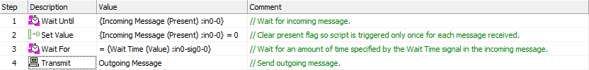

# Script Type Function Block: Resetting the Present Flag

### The Present Flag

One of the most common actions in a function block script is to wait for receipt of a message before executing a block of code. To aid in this, each message has associated with it a property called the **Present** flag. This variable is set to **False** (**0**) when Vehicle Spy starts, and then changed to **True** (**1**) when a message is received, indicating that the message is now present.

Many actions need to be triggered only once for each copy of a particular message that is received. However, once the **Present** flag is set, it will remain set as long as Vehicle Spy stays online (because a received message remains "present"; it doesn't disappear on its own.) To ensure that a script section runs only once for each message copy, it is necessary to reset (or clear) the **Present** flag after each time it is seen as **True**, so that only a new message will set it again.

There are two common ways of resetting the **Present** flag.

### Resetting the Present Flag using the Set Value command

The most precise method is to directly target the **Present** flag itself, simply setting its value to **0** using a [Set Value](script-type-function-block-commands/script-type-function-block-command-set-value.md) command. This allows you to clear the **Present** flag without affecting other message properties. An example is shown in Figure 1.

You can also use Set Value If in a similar fashion, when that would be more useful.

### Resetting the Present Flag using the Clear Stats command

A secondary method is to use the [Clear Stats](script-type-function-block-commands/script-type-function-block-command-clear-stats.md) command targeting a message. An example of this can be seen in Figure 1.

**Important Note:** Using **Clear Stats** in this manner resets not only the **Present** flag, but also all other information related to the message, including its data. If you will need to work with other properties or data in the message, it is recommended that you instead use **Set Value** as described above.

