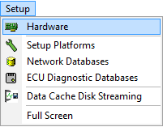

# Main Menu: Setup

The Vehicle Spy Setup main menu contains hardware and database configuration tools as shown in **Figure 1**.

Refer to **Table 1** for a brief description of each selection.

**Table 1: Vehicle Spy Setup Menu**

| Setup Menu Selection                                              | Description                                                      |
| ----------------------------------------------------------------- | ---------------------------------------------------------------- |
| [Hardware](../main-menu-spy-networks/networks/setup-a-network.md) | Opens the Network view to configure hardware                     |
| [Setup platforms](setup-platforms.md)                             | Opens a dialog to add, rename, copy, or remove platforms         |
| [Network Databases](network-databases.md)                         | Opens the Network Database view to configure database platforms. |
| [ECU Diagnostic Database Databases](ecus-view/)                   | Opens the ECUs view to setup diagnostic information for ECUs.    |
|                                                                   |                                                                  |
| [Data Cache Disk Streaming](data-cache-disk-streaming.md)         | Configures data cache disk streaming in Vehicle Spy.             |
|                                                                   |                                                                  |
| Full Screen                                                       | Maximizes Vehicle Spy to use the full screen.                    |
