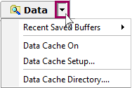

# Data Cache Disk Streaming

Data Cache Disk Streaming provides a fast way to save large amounts of unfiltered data in a binary format (.vsb) message buffer file. This feature can be accessed using the Vehicle Spy [Setup](./) main menu or the dropdown button next to the **Data Directory** button as shown in **Figure 1**.

To enable or disable Data Cache Disk Streaming, use the **setup dialog** checkbox or the **Data Cache On** dropdown list selection while Vehicle Spy is offline.Once enabled, all network traffic will be streamed to disk anytime Vehicle Spy is running.Data is saved in a binary format (.vsb) file in the Vehicle Spy 3\DataCache directory with a specific date and timestamp.A new data cache file is created each time Vehicle Spy transitions from offline to online while Data Cache Disk Streaming is enabled.\
\
If more advanced buffer capture features are needed then [Capture type function blocks](../main-menu-scripting-and-automation/function-blocks/function-blocks-types/capture-type-function-block/) can be used instead.
