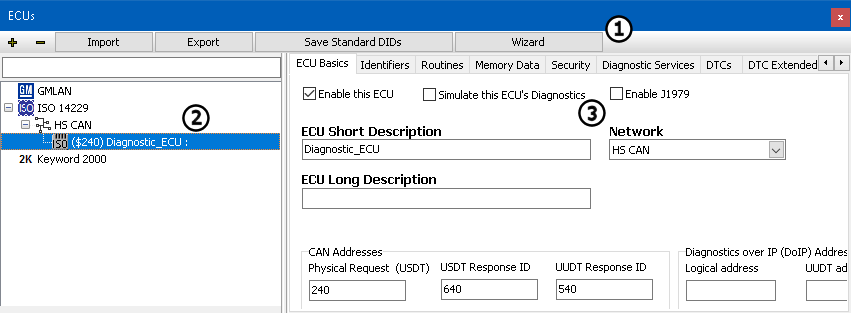

# ECUs View

Each vehicle network contains a collection of nodes or ECUs. ECUs are Electronic Control Units which act as transmitters and receivers of messages. The ECUs view lets you to create and edit a database of ECUs organized by their diagnostic protocol. ECUs can be assigned to normal mode messages using the Messages Editor. ECUs can also be assigned to user defined diagnostic jobs using the [Diagnostics Setup](../../main-menu-spy-networks/diagnostics/diagnostics-setup.md).\
\
To quickly open ECUs view, click the **Setup ECUs** button  located just below the Vehicle Spy main menu selections. The [Setup](../) and [Spy Networks](../../main-menu-spy-networks/) main menus can also be used to open ECUs view. When this view opens it will show a list of ECUs from the loaded [diagnostics database](../network-databases.md) file (\*.gmd). The ECUs view is divided into three major areas as shown in **Figure 1**.

The top area (Figure 1:) has buttons for performing tasks common across many ECUs. The **+ and - buttons** add and delete an ECU. When **+ button** is clicked a diagnostic protocol for that ECU must be selected from [GMLAN](../../main-menu-spy-networks/ecus-view/gmlan-ecus.md), [ISO 14229](../../main-menu-spy-networks/ecus-view/iso-14229-ecus.md), or [Keyword 2000](../../main-menu-spy-networks/ecus-view/keyword-2000-ecus.md). Use the **Import** and **Export** buttons to work with other diagnostic database formats like .gdx, .mdx, .odx, .xls, etc. The **Save Standard DIDs** button saves changes made to GMLAN standard DIDs; this action affects all GMLAN type ECUs. The **Save Database Changes** button saves all changes made in the ECUs view to the diagnostics database file (\*.gmd). Click the **Wizard** button to detect and resolve any address conflicts between ECUs that share the same diagnostic address on the same network. For example, consider a chime module and a radio module. Some vehicles have one or the other, so the ECU diagnostic address could be the same for both. Use the ECUs Wizard to let Vehicle Spy know which ECU is active to properly communicate with it.\
\
The lower left area (Figure 1:) is for finding and selecting an ECU.The ECU tree is organized by diagnostic protocol, then by network, then by the ECU diagnostic address. Click the small +/- toggle buttons on each branch to expand and contract that tree branch. Type in the search field above the tree to quickly find ECUs in a large tree. Any ECUs disabled manually or by the Wizard will appear light gray in the tree. Any ECUs with their diagnostic simulation enabled will have the red text sim on its icon.\
\
The lower right area (Figure 1:) is for setting up the selected ECU. The first tab is always the **ECU Basics** tab. On this tab you can enable/disable an ECU to help deal with address conflicts, but the Wizard button described above can set this automatically. Checking the box next to **Simulate this ECU's Diagnostics** can be useful for debugging a .vs3 setup file without using network hardware running in [simulation mode](../../../basic-operation-of-vehicle-spy/running-and-stopping.md). When enabled, Vehicle Spy will simulate the ECU response to a diagnostic request using a diagnostic message with random data content. Other basic information on this tab includes the ECU's short name, long name, [network](../../main-menu-spy-networks/networks/setup-a-network.md), and diagnostic address/identifier. For GMLAN ECUs, this tab also has the Virtual Network Management Frame (VNMF) ID. If the selected ECU is from a database, then all of this information should already be configured. If a new ECU is being created or changed, then this information can be updated.\
\
The remaining setup tabs in the lower right area (Figure 1:) are different depending on which type of ECU ([GMLAN](../../main-menu-spy-networks/ecus-view/gmlan-ecus.md), [ISO 14229](../../main-menu-spy-networks/ecus-view/iso-14229-ecus.md), or [Keyword 2000](../../main-menu-spy-networks/ecus-view/keyword-2000-ecus.md)) has been selected in the tree on the left.
