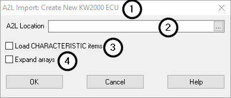

# ECU A2L Import Options

This dialog allows the user to fine-tune the import of an A2L file into a new or existing ECU.

* **The title bar** (Figure 1:) indicates what is happening.  Here you will see if you're importing an A2L into an exsiting ECU, or if you are creating a new ECU.
* **A2L Location**: the full path to the A2L file you want to import.  Click the elipsis (...) button to open a file picker dialog.  (Figure 1:)
* **Load CHARACTERISTIC items** (Figure 1:) **checkbox**:  Check this box if you want to import CHARACTERISTIC data elements from the A2L file as well as MEASUREMENT data elements.  CHARACTERISTIC data elements are typically multi-dimensional values that are used for calibration, while MEASUREMENT data elements are typically intended for data acquisition.  This setting will be remembered for future imports.
* **Expand arrays** (Figure 1:) **checkbox**: Check this box if you want to expand arrays or MATRIX data elements from the A2L file.  If there was a MEASUREMENT data element that was specified as a MATRIX with 1000 items, checking this box would create 1000 individual items for data collection.  With the box unchecked, only the first element will be created.  This is a way to reduce the size of the channels list if you have a lot of array-type items that you're not interested in.  This setting will be remembered for future imports.
