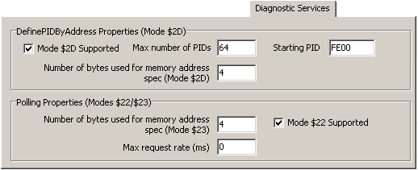

# ECU Diagnostic Services Tab

The Diagnostic Services tab contains other information about the ECU. The DPIDs area allows the user to specify the number of Dynamic and Static DPIDs the ECU supports. This information is used when requesting DPID information in the [VehicleScape DAQ](../../main-menu-measurement/vehiclescape-daq/) view. Settings are also present for how Memory Data should be requested.

