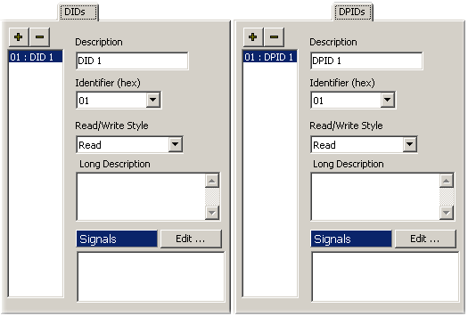
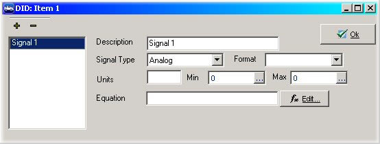

# Edit ECU Diagnostic Database

The other tabs in the ECUs dialog are for entering in the decoding for diagnostic information. DID, LID, DPID, PID, ID, CPID, Memory Data, and standard DID information is entered in the appropriate tab for each data item. The dialogs for entering in data for all the different types are the same. Once you learn one, you have learned them all! Figure 1 shows the dialog for DIDs and DPIDs. Note how they look almost identical.\
\
The "+" adds new items and the "-" will remove items. Once "+" is clicked, entry boxes on the right will appear. The information for these entry boxes should be given in the ECU's specifications. The list below describes each field.

* **Description** - This field is just a text description of the data item.
* **Identifier** - A one byte field telling the ID number for this field. This would be the DID, LID, DPID, or CPID number. PIDs and Memory Data do not have this field. PIDs have a field called Parameter ID which is a 2 byte field, and Memory Data has a field called Starting Memory address. The field serves the same purpose, it is just a little different.
* **Read/Write Style** - This field tells what type of access this data item has. Some items are read only and some require security access. Choose the appropriate item from the list.
* **Long Description** - This description field allows for a longer explanation of the data item. This can be very useful, especially if other people will be looking at this information.
* **Signals** - This is where all the different signal information is decoded from the data item.

Signal decoding in ECUs view is done exactly the same way it was done in [Messages Editor](https://cdn.intrepidcs.net/support/VehicleSpy/spyInDecode.htm) view. Click "Edit" to bring up the signal decoding window. Click the "+" to add a new signal. Figure 2 shows what the window will look like. Below is a description for each field in the dialog.

* **Description** - This is the name of the signal. When this signal is selected in the Equation Editor, this is the text it will have.
* **Signal Type** - This field tells Vehicle Spy what type of signal is being decoded. The choices are: Analog, Digital, State Encoded, Text, DTC, GMLAN, and ODI.
* **Format** - Changing this option changes the way that this value is presented to the user. For analog signals, the number of digits after the decimal point can be specified. For digital values the text for True and False can be changed.
* **Units** - Enter units for the decoded signal in the Units field.
* **Min, Max** - Minimum and Maximum are just that! Enter the minimum and maximum values that the decoded signal can have in these fields.
* **Equation** - The equation field is where which bits and bytes that make up this signal are specified. Clicking the Edit button will bring up an editor dialog to easily set the decoding information. The editor interface changes depending upon which Signal Type is selected. For help on using the editor dialogs [click here](../../main-menu-spy-networks/message-editor/message-signals/message-signal-type.md).

Changes to the Standard DID list need to be saved using the "Save Standard DIDs" button at the top of the ECUs window.

