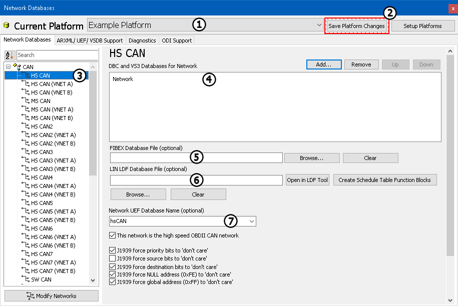
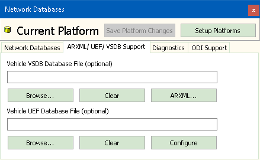
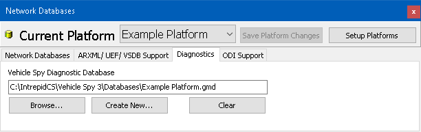

# Network Databases

Network databases can be configured using the **Setup> Network Databases** menu selection or by selecting the **Network Databases** icon  from the Menu Bar.

The Database Platforms view (Figure 1) is divided into two main sections. At the top, notice the **Current Platform** (Figure 1:). A platform is a group of network databases. Each network database defines all messages for a given network like HSCAN, MSCAN, etc. You can create multiple platforms and quickly switch between them as needed. Two buttons sit just to the right of the **Current Platform** drop down: **Save** **Platform Changes** & **Setup Platforms** (Figure 1:). The **Save Platform Changes** updates any changes you have made in the Database view. This button will flash red when changes have not been saved. **Setup Platforms** opens a dialog to add, rename, copy, or remove platforms. Shortcuts to **Save Platform Changes**  and **Setup Platforms**  can also be found on the Menu Bar.

Just below the **Current Platform** section is a tabbed interface. Descriptions of each tab follow below:

#### Network Databases:

On the left side of the Network Databases tab is a list of possible networks (Figure 1:). Add additional networks by selecting **Add** just above the list. **Rename** or **Remove** networks by using the buttons at the bottom of the list. When a network in the list is selected, the right half of the tab switches to setup fields for that network.

The first field is for **DBC and VS3 Databases for Network** (Figure 1:). (The \*.VS3 type of database is a Vehicle Spy 3 setup file. It uses the Receive message table from another setup file as a database.) Press the **Add** button at the far right and choose the desired database type from the pop up menu. After you choose the type, a dialog will open allowing you to choose the file from its location on your computer.

The second field is for specifying a **FIBEX Database** (Field Bus Exchange) file for FlexRay (Figure 1:). Click the **Browse** button to select the file from its location on your computer. Press **Clear** to remove the file.

The third field is for specifying a **LIN LDF Database File** (Figure 1:). Press the **View** button to open the LDF Tool to setup LIN capabilities. Use the **Create Schedule Table Function Blocks** button to create Function Blocks to help simulate LIN nodes.

The fourth field is for selecting a **Network UEF Database Name** (Figure 1:).

#### UEF / VSDB Support:

The **UEF / VSDB Support**tab (Figure 2) is where a Vehicle UEF Database file and/or Vehicle Spy Message database (VSDB file) can be configured. Press **Browse** to select the file. Press **Clear** to remove a file. Using **ARXML**, AUTOSAR files can be imported.

#### Diagnostics:

The **Diagnostics** tab (Figure 3) is where a Vehicle Spy diagnostic database is specified. These files have a GMD extension and hold information on diagnostic parameters like DIDs, PIDs, DPIDs, CPIDs, memory addresses, etc. The diagnostic parameters can be manually created within Vehicle Spy or imported from other diagnostic database file formats like A2L, ODX, MDX, or GDX using the ECUs view. Information in the GMD database is used for Snapshot and the Diagnostics Setup view in Vehicle Spy. Press **Browse** to select an existing file. Press **Create New** to make a new file. Press **Clear** to remove the file.

#### ODI Support & John Deere:

Setup tabs for other unique OEM database formats.
