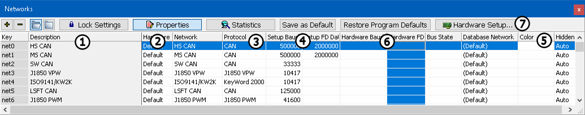

# Setup a Network

The Vehicle Spy main menu selections [**Setup**](./)**> Hardware** and [**Spy Networks**](../main-menu-spy-networks/)**> Networks** basically have the same interface and features related to networks. The main difference is that the Networks selection has an additional [Network Statistics](../main-menu-spy-networks/networks/network-statistics.md) display mode. The common interface and features are described here. (Figure 1 is the Properties display mode if using the Networks selection.)

Each row in the table represents a network as shown in **Figure 1**. Networks can be added and deleted by clicking the **+** and **-** buttons in the upper left corner. Selecting the open folder will show all networks, selecting the closed folder will hide any unused networks. Each network can be configured using pulldown list selections in each of its columns within the table. Network changes can be stored as Vehicle Spy defaults by clicking the **Save as Default** button. Vehicle Spy comes with default networks and settings that can always be quickly restored back to the originals by clicking the **Restore Program Defaults** button.

The description column displays the name of the network that is being setup (Figure 1:). The text entered in the description field will appear throughout Vehicle Spy to describe this network. The Network column (Figure 1:) tells Vehicle Spy what hardware channel to map to what physical network on the attached hardware. The Protocol column (Figure 1:) displays the base protocol that is used for this network.

You can also specify a color for a network (Figure 1:). This color setting allows you to [filter networks by color](../main-menu-spy-networks/messages-view/messages-view-bottom-toolbar/color-filters.md) in the [Messages](../main-menu-spy-networks/messages-view/) view.

Baud Rate and Hardware Rate together specify the baud rate for a network. Baud Rate (Figure 1:) tells what baud rate is set in the Vehicle Spy VS3 file. Hardware Rate (Figure 1:) tells what baud rate is set in the interface hardware for that network. When you start Vehicle Spy with hardware connected and these columns do not match, Vehicle Spy will ask which of the two baud rates to use. (Note: [Enable Bit Rate Sync](../main-menu-tools/tools-options/options-spy-networks-tab/) must be enabled in the Tools > Options menu.)

The neoVI 3G Explorer application can be opened to see other hardware features by clicking the **Hardware Setup** button (Figure 1:).

