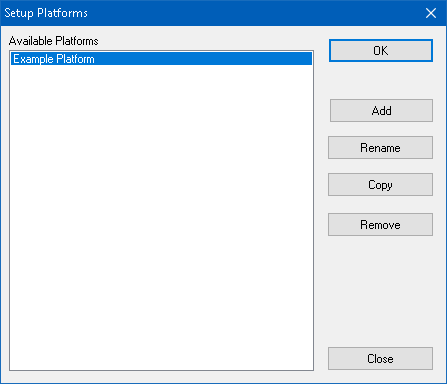

# Setup Platforms

Platforms link database information together. When a database platform is selected, all associated database files are loaded into Vehicle Spy. This includes .DBC files for CAN, .LDF files for LIN, and diagnostic information saved to the platform. The first step to working with a platform is to create one. The Setup Platforms dialog give options to add, rename, copy, or remove a database platform.

