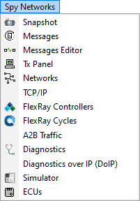

# Main Menu: Spy Networks

The **Spy Networks** menu contains many common tasks as shown in **Figure 1**. Refer to **Table 1** for a brief description of each selection.

**Table 1: Spy Networks task descriptions.**

| Spy Networks Menu Selection                               | Description                                                                                                                                                                                                          |
| --------------------------------------------------------- | -------------------------------------------------------------------------------------------------------------------------------------------------------------------------------------------------------------------- |
| [Snapshot](snapshot.md)                                   | Opens Snapshot view for quick and simple diagnostics. Note: GMLAN must be enabled on the Tools -> Options, [Spy Networks tab](https://cdn.intrepidcs.net/support/VehicleSpy/spyHardSetup.htm) to see this selection. |
| [Messages](messages-view/)                                | Opens Messages view to monitor message traffic.                                                                                                                                                                      |
| [Messages Editor](message-editor/)                        | Opens Messages Editor for creating and viewing message and signal definitions.                                                                                                                                       |
| [Tx Panel](transmit-panel/)                               | Opens Tx Panel for transmitting messages.                                                                                                                                                                            |
| [Networks](networks/)                                     | Opens Networks view to configure hardware and networks.                                                                                                                                                              |
| [TCP/IP](tcp-ip.md)                                       | Opens TCP/IP view to allow for modification of a device's ethernet settings.                                                                                                                                         |
| [FlexRay Controllers](flexray-controllers/)               | Opens FlexRay Controllers view for configuring and modifying FlexRay controllers.                                                                                                                                    |
| [FlexRay Cycles](flexray-cycles.md)                       | Opens FlexRay cycles view.                                                                                                                                                                                           |
| A2B Traffic                                               | Opens A2B view which allows the monitoring and modification of Automotive Audio Bus traffic.                                                                                                                         |
| [Diagnostics](diagnostics/diagnostics-view.md)            | Opens Diagnostics view for launching diagnostic jobs and seeing their results.                                                                                                                                       |
| [Diagnostics over IP (DoIP)](diagnostics-over-ip-doip.md) | Opens DoIP view for sending Diagnostic jobs over IP.                                                                                                                                                                 |
| [Simulator](simulator.md)                                 | Opens Simulator view for configuring a simulation from a database.                                                                                                                                                   |
| [ECUs](../main-menu-setup/ecus-view/)                     | Opens ECUs view to setup diagnostic information for ECUs.                                                                                                                                                            |
