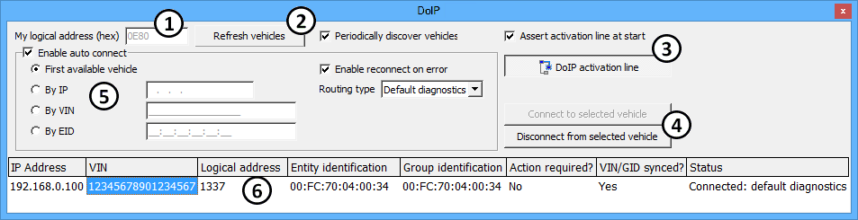

# Diagnostics over IP (DoIP)

Diagnostics over Internet Protocol (DoIP) requires diagnostic communications to use IP, TCP, and UDP protocols on an ethernet network. A vehicle with DoIP typically has one "edge node" ECU to transfer all diagnostic messages between a test tool on ethernet and other ECUs on other networks like CAN, LIN, FlexRay, etc. Requirements for DoIP are defined in ISO 13400.\
\
Use Vehicle Spy's **Diagnostics over IP (DoIP)** to discover and connect to an edge node ECU, which then allows [Diagnostics](diagnostics/diagnostics-view.md) to be sent to other ECUs on the vehicle. The DoIP connection can be setup to run manually or automatically after each time Vehicle Spy goes online with hardware. DoIP is opened from the [Spy Networks](./) menu.

### Making a DoIP Connection Has 2 Phases - Discover then Connect

Follow these steps to make a Vehicle Spy DoIP connection to a vehicle:

1. Connect DoIP capable ICS hardware (like FIRE2) to the vehicle data link connector and PC USB.
2. Verify Tools > Options > [Spy Networks tab](../main-menu-tools/tools-options/options-spy-networks-tab/) has "Use PC Ethernet interface" = ON.
3. In [TCP/IP](tcp-ip.md) view, set the **MAC address** = Inherit from device and **IP address** = Inherit from OS.
4. In DoIP, verify the **Assert activation line at start** checkbox is enabled.
5. Take VSpy [online](../../basic-operation-of-vehicle-spy/running-and-stopping.md) with the ICS hardware from step 1.
6. In DoIP, click **Refresh vehicles**. A vehicle should appear in the response table with status "Disconnected".
7. Click on the vehicle then **Connect to selected vehicle** -> Connect -> Default diagnostics. The vehicle status should change to "Connected".
8. [Diagnostics](diagnostics/diagnostics-view.md) can now be used to send DoIP jobs to specific ECUs.

A physical activation line between the ICS hardware and edge node ECU must be active for DoIP to work. If **Assert activation line at start** (Figure 1:) is enabled then Vehicle Spy will activate the DoIP line each time it goes online with hardware. The line can also be controlled directly by clicking on the **DoIP activation line** button.

### Details of Settings

**My logical address (hex)** (Figure 1:) identifies Vehicle Spy as a test tool to the vehicle. Test tools have three valid address ranges to choose from and Vehicle Spy uses a default value of 0E80.

* 0E00 - 0E7F Legislated diagnostic test tools that run emissions tests.
* 0E80 - 0EFF Aftermarket test tools. VSpy usually belongs in this range.
* 0F80 - 0FFF Prolonged data loggers, like those used by insurance companies.

Click **Refresh vehicles** (Figure 1:) to send one vehicle identification request on the ethernet network that will discover edge node ECUs. If **Periodically discover vehicles** is enabled then the requests are sent by Vehicle Spy at a 5 s periodic rate. Valid responses from edge node ECUs are indicated in the status table located in the lower area of DoIP.\
\
To connect to a vehicle, click on it in the DoIP status table then click **Connect to selected vehicle** (Figure 1:).To disconnect, use **Disconnect from selected vehicle**. A right click menu also supports vehicle connect and disconnect.

### Auto Connect

**Enable auto connect** (Figure 1:) means Vehicle Spy will try to connect using DoIP each time it goes online with hardware, which removes the need to click the DoIP connect to vehicle button each time.\
\
NOTE: This feature does NOT automatically discover vehicles which is done by setting Periodically discover vehicles = on.\
\
The automatic connection can be setup to connect to:

* **First available vehicle** - the first vehicle that responds.
* **By IP** - the edge node ECU that has this IP address.
* **By VIN** - the vehicle that has this Vehicle Identification Number.
* **By EID** - the edge node ECU that has this Entity Identification (i.e. MAC) address.

**Enable reconnect on error** will make Vehicle Spy retry the DoIP connection if an error occurs during the linking process.\
\
**Routing type** supports the following authentication/confirmation methods for the DoIP linking process:

* Default diagnostics - default method per ISO 13400.
* WWH-OBD - World Wide Harmonized On-Board Diagnostics method per ISO 27145.
* Central security - secured linking method as defined by each OEM.

### DoIP Status Table

Valid responses from edge node ECUs are indicated in the status table located in the lower area of DoIP (Figure 1:).

**Table 1: DoIP Status Table**

| Table Column          | Description                                                                                                |
| --------------------- | ---------------------------------------------------------------------------------------------------------- |
| IP Address            | IP address of the edge node ECU.                                                                           |
| VIN                   | Vehicle Identification Number of the vehicle.                                                              |
| Logical Address       | Logical address of the edge node ECU.                                                                      |
| Entity Identification | MAC address of the edge node ECU.                                                                          |
| Group Identification  | An identifier used in place of the VIN if the VIN is not programmed yet.                                   |
| Action Required?      | If yes, then central security is required.                                                                 |
| VIN/GID synced?       | If yes, then the edge node ECU is reporting all ECUs it sees are synchronized to the same VIN or Group ID. |
| Status                | Vehicle Spy's current status of the DoIP connection with the vehicle.                                      |
