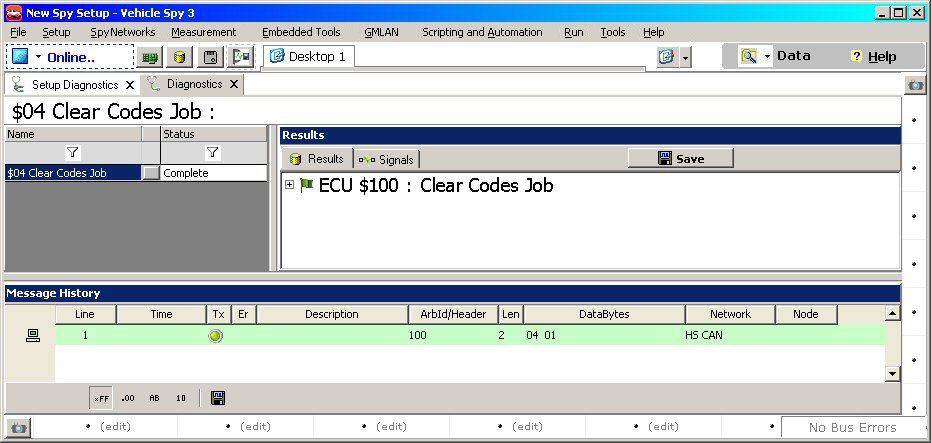

# Diagnostics

Vehicle Spy allows diagnostic messages to be quickly built into diagnostic jobs using built-in diagnostic services. Vehicle Spy can also transmit diagnostic jobs and decode their responses.\
\
Diagnostic jobs are built on the Setup Diagnostics screen (Spy Networks->[Diagnostics Setup](diagnostics-setup.md)). After a job is built, it can be launched directly from the screen by clicking the Launch button.\
\
If a job is launched from the setup screen, Vehicle Spy will automatically switch to the Diagnostics screen to show you the decoded results (Figure 1). The Diagnostics screen (Spy Networks->[Diagnostics](diagnostics-view.md)) can also be accessed with the mouse to launch jobs and see the results.

