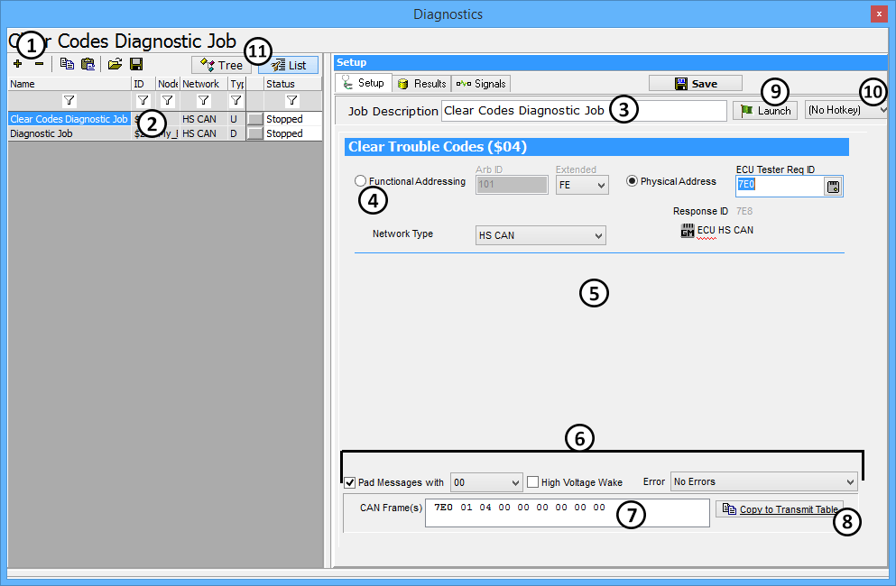

# Diagnostics Setup

The Setup Diagnostics screen (Figure 1) is where diagnostic jobs are built and edited. This screen is found by selecting **Spy Networks > Diagnostics** and selecting the **Setup** tab.\
\
The **+ and - buttons** (Figure 1:) allow a user to add and delete services in a Vehicle Spy setup. Once the **+ button** is clicked, choose which type of diagnostics to perform, then select the job to setup from the list that appears. Once a service is selected, its name shows up in the job list (Figure 1:). The name of the service, or job, can be changed by typing directly in the **Job Description** box (Figure 1:). Renaming is very useful for keeping jobs organized. A diagnostic job can be deleted by selecting it from the job list (Figure 1:) and then clicking the **- button**.

Jobs are configured on the right side of the window. There are three main sections for setting up a service. The top portion gives options for addressing (Figure 1:). The middle portion contains settings for the parameters of the service (Figure 1:). This is where things such as sub functions and data identifiers are specified. The bottom portion gives options for the formatting of the request message to send (Figure 1:). This section is where padding and wakeups can be configured. The message that is created can be seen in the CAN Frame(s) box (Figure 1:) at the bottom of the editor.\
\
Launching the service can be done in a few different ways. The first is to use the transmit panel. Before this can be done, the build request message needs to be transferred to the transmit table. This can be done by clicking the **Copy to Transmit Table** button (Figure 1:). Another method is by assigning a **hotkey** (Figure1:). An easier approach to sending the request is to click the **Launch** button (Figure 1:). This will switch the screen to the Results tab and launch the service in one click. When the response is returned, it will be decoded according to the diagnostic database that is currently configured.\
**Tree** and **List** (Figure 1:), give two different ways to sort diagnostic jobs. List shows all the diagnostic jobs in a list, while Tree groups ECUs and jobs.
