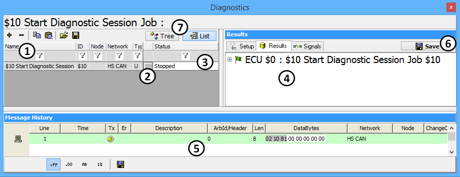

# Diagnostics View

Diagnostic jobs are launched using the Diagnostics screen (Figure 1) in Vehicle Spy. This screen is found under **Spy Networks> Diagnostics**.\
\
Use the **+ button** in the upper left **** to add jobs from the specified diagnostic service. You can remove a job by selecting the - button from the same area.\
\
Jobs will be listed under the **Name** field on the left (Figure 1:). To launch a job, click the gray button just right of its name (Figure 1:). The job **Status** column (Figure 1:) will tell you if the job is running or complete.\
\
The response data appears in three locations in different formats. The simplest two are found in the **Results** area (Figure 1:).\
\
The default view is the **Results** tab which gives the information in a simple text based format. Each line can be expanded to show more details by clicking the **+** in front of the text.\
\
Clicking on the **Signals** tab will display the response data in a table format. The table includes information like number of negative responses, success, time the service took to run, and the decoded signals that were returned.\
\
The other place to see the response data is in the **Message History** area (Figure 1:). This shows a small message history filtered for diagnostic messages. The acquired data can be saved using the **Save** button (Figure 1:).\
\
**Tree** and **List** (Figure 1:), give two different ways to sort diagnostic jobs. **List** shows all the diagnostic jobs in a list, while **Tree** groups ECUs and jobs.

**\*Note:** Signals acquired from diagnostic jobs can be used throughout Vehicle Spy just like any other signal. In the Expression Builder, diagnostic signals are saved under Jobs.
