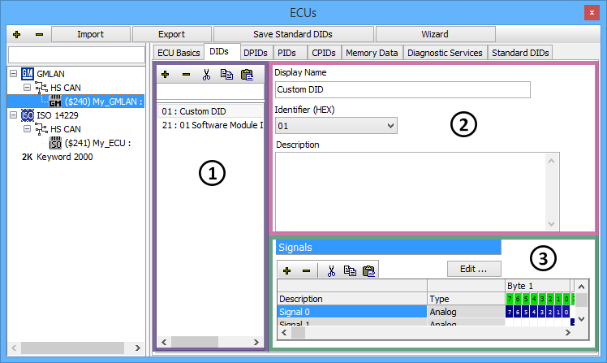
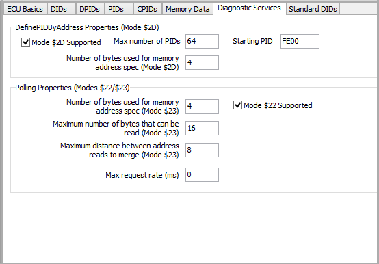

# GMLAN ECUs

If a GMLAN ECU is selected on the [ECUs](../../main-menu-setup/ecus-view/) view then the tabs after the ECU Basics tab will look like those along the top of **Figure 1**. These other tabs let you create and change diagnostic items like DIDs, DPIDs, PIDs, CPIDs, Memory Data, and Standard DIDs. Just click on a tab to see all items of that type in the ECU. A shared interface is used to enter data for the different types of items. Once you learn one, you have learned them all! The DIDs tab in Figure 1 is an example of this interface.

The area on the left (Figure 1: ) has a list for finding, selecting, and editing diagnostic items. The **+** and **-** buttons add and delete items in the list. The cut, copy, and paste buttons will cut, copy, and paste items in the list. Type in the search field above the list to quickly find items in a long list. Note that Standard DIDs are predefined and apply to all GMLAN ECUs. If a DID redefines one of the Standard DIDs, the DID list will show **Override Standard DID** text to let you know the Standard DID definition is being ignored.\
\
The upper right area (Figure 1: ) defines basic aspects of the item selected in the list. The first field is the item's short name used for display throughout Vehicle Spy. The second field is the item's hexadecimal identifier and varies slightly depending upon the item type. For DIDs, DPIDs, and CPIDs it is a 1 byte Identifier. For PIDs it is a 2 byte Parameter ID. For Memory Data it is a 2 to 4 byte Start Memory Address. The third field can have a long description to help understand what the item is or describe its data.\
\
The lower right area (Figure 1: ) defines signals for the diagnostic item selected in the list. Signals are defined the same way as [message signals](../message-editor/message-signals/) are defined in the Messages Editor.

### Diagnostic Services Tab (Figure 2)

The Diagnostic Services tab contains other information about the GMLAN ECU. This information is used when requesting PID and Memory information in the [VehicleScape DAQ](../../main-menu-measurement/vehiclescape-daq/) view.

### Saving Changes

At the top of the ECUs view, above the tabs, there are 2 buttons for saving changes. If changes are made on the Standard DIDs tab then click the **Save Standard DIDs** button to save the changes in the **GMLAN Standard DIDs.xml** file. These changes will affect all GMLAN ECUs!\
\
When finished making changes on the other tabs don't forget to click the **Save Database Changes** button. This will store the data into the [diagnostics database](../../main-menu-setup/network-databases.md) file (\*.gmd).
